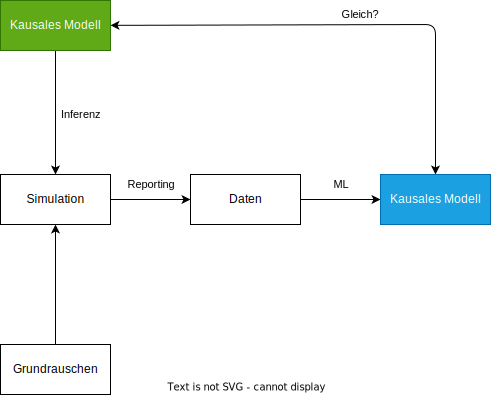
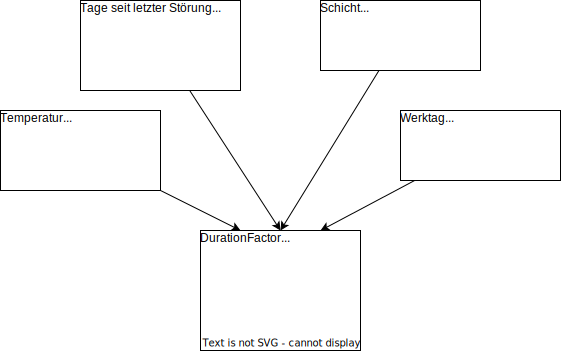

[Zurück zur Gliederung](../../readme.md)

<br />

# Anwendung der Simulationsbibliothek

- [Konfiguration](#konfiguration)
  - [Maschinen](#maschinen)
  - [Werkzeuge](#werkzeuge)
  - [Arbeitspläne](#arbeitspläne)
  - [UI für einfache Erstellung von Konfigurationsdateien](#ui-für-einfache-erstellung-von-konfigurationsdateien)
- [Beispiel-Anwendung in .NET](#beispiel-anwendung-in-net)
  - [Beispielhafte Logger-Konfiguration](#beispielhafte-logger-konfiguration)
  - [Beispielhafte Szenario-Konfiguration](#beispielhafte-szenario-konfiguration)
    - [Schritt-für-Schritt Erklärung der Szenario-Konfiguration](#schritt-für-schritt-erklärung-der-szenario-konfiguration)
    - [Details zur Unterbrechungslogik](#details-zur-unterbrechungslogik)
    - [Details zur Simulation von Einflussfaktoren](#details-zur-simulation-von-einflussfaktoren)
  - [Starten der Simulation](#starten-der-simulation)
  - [Ergebnisse der Simulation](#ergebnisse-der-simulation)
  - [Zusammenfassung](#zusammenfassung)
- [Beispiel-Anwendung in Python](#beispiel-anwendung-in-python)
  - [Python-Anwendung im Detail](#python-anwendung-im-detail)
  - [Unterschiede zwischen Python und .NET](#unterschiede-python-net)
    - [Verwendung von Linq-Funktionen](#verwendung-von-linq-funktionen)
    - [Verwendung von Funktionen/Delegates](#verwendung-von-funktionendelegates)
    - [Verwendung von Generator-Funktionen](#verwendung-von-generator-funktionen)
    - [Verwendung von C#-Interfaces in Python](#verwendung-von-c-interfaces-in-python)
  - [Ausführen der Python-Anwendung](#ausführen-der-python-anwendung)
- [Nutzung von statistischer Inferenz zur Simulation von Daten nach einem Modell](#nutzung-von-statistischer-inferenz-zur-simulation-von-daten-nach-einem-modell)
  - [Beispiel-Modell](#beispiel-modell)
  - [Diskrete Modelle](#diskrete-modelle)
  - [Stetige Modelle](#stetige-modelle)
- [Structure Learning zum Lernen eines den Daten zugrunde liegenden Modells](#structure-learning)
  - [Structure Learning am Beispiel](#structure-learning-am-beispiel)
  - [Fazit](#fazit)

## Konfiguration

Die Konfigurierbarkeit der Applikation ist ein zentrales Features und ist für die Komplexität des zugrundeliegenden Problems von großer Bedeutung. Die Konfiguration der Stammdaten erfolgt über JSON-Dateien, die die verschiedenen Ressourcen und Parameter enthalten. Die Konfigurationen werden in den folgenden Abschnitten genauer beschrieben.

### Maschinen

Die in der Produktion vorhandenen Maschinen werden anhand ihres entsprechenden Typs konfiguriert. Dabei wird vereinfacht angenommen, dass jede Maschine eines Typs die gleichen Eigenschaften besitzt. Für jeden Maschinentyp sind folgende Eigenschaften konfigurierbar:

- `typeId`: eine eindeutige ID
- `count`: die Anzahl der vorhandenen Maschinen dieses Typs
- `name`: ein Name
- `allowedToolIds`: eine Liste von auf diesem Maschinentyp erlaubten Werkzeugen (dabei werden die Typ-Ids der jeweiligen Werkzeuge angegeben, siehe [Werkzeuge](#werkzeuge))
- `changeoverTimes`: eine Rüstzeitmatrix. Diese ist wie folgt aufgebaut: Das Element in Zeile x und Spalte y enthält die Rüstzeit in Minuten, die benötigt wird, um auf diesem Maschinentyp von dem Werkzeug an der x-ten Stelle im `allowedToolIds`-Array umzurüsten auf das Werkzeug an der y-ten Stelle in dem Array. In den Diagonalelementen (Zeile z, Spalte z) der Matrix können somit auch Rüst- oder Vorbereitungszeiten angegeben werden, die bei der Nutzung eines bestimmten Werkzeugs vor jedem Arbeitsgang anfallen.
  Ein Beispiel ist [hier](#rustzeitbsp) genauer beschrieben.

Der folgende Ausschnitt zeigt ein Beispiel für die Konfiguration einer Maschine.

```json
{
  "typeId": 1,
  "count": 1,
  "name": "Machine 1",
  "allowedToolIds": [1, 3, 4],
  "changeoverTimes": [
    [0.0, 5.0, 12.5],
    [5.0, 0.0, 10.0],
    [12.5, 10.0, 2.0]
  ]
}
```

<a id="rustzeitbsp"></a>
Die auf dieser Maschine erlaubten Werkzeuge sind die Werkzeuge 1, 3 und 4.

Die Rüstzeit-Matrix enthält unter anderem folgende Angaben: In der ersten Zeile und zweiten Spalte sind 5 Minuten Rüstzeit angegeben.
Das bedeutet, dass der Wechsel vom ersten Werkzeug im `allowedToolIds`-Array (Werkzeug 1) zum zweiten Werkzeug in diesem Array (Werkzeug 3) durchschnittlich 5 Minuten dauert.
In Zeile 2, Spalte 3 ist angegeben, dass der Wechsel von Werkzeug 3 (2-tes Werkzeug im `allowedToolIds`-Array) zu Werkzeug 4 (3-tes Werkzeug im `allowedToolIds`-Array) 10 Minuten dauert. Außerdem ist im dritten Diagonalelement (Zeile 3, Spalte 3) angegeben, dass vor jedem Arbeitsgang mit dem dritten Werkzeug (Werkzeug 4) 2 Minuten Rüst- bzw. Vorbereitungszeit benötigt werden.

In diesem Beispiel ist die Matrix symmetrisch, dies ist aber nicht notwendigerweise der Fall.

### Werkzeuge

Werkzeuge werden ebenfalls anhand ihres Typs konfiguriert. Ein Werkzeugtyp kann dabei ein bestimmtes tatsächlich existierendes Werkzeug beschreiben, kann aber auch einen bestimmten Operationsmodus einer Maschine abbilden.
Für ein Werkzeug sind folgende Eigenschaften konfigurierbar:

- `typeId`: eine eindeutige ID
- `name`: ein Name
- `description`: eine Beschreibung.

Der folgende Ausschnitt zeigt ein Beispiel für die Konfiguration eines Werkzeugs.

```json
{
  "typeId": 1,
  "name": "Tool 1",
  "description": "Tool 1"
}
```

### Arbeitspläne

Arbeitspläne sind die dem Produktionsprozess zugrunde liegenden Stammdaten. Sie beschreiben, welche Arbeitsschritte notwendig sind, um ein bestimmtes Produkt herzustellen.
Die Arbeitspläne werden dabei als eine Liste von Arbeitsgängen (alternativ: Arbeitsplanpositionen) beschrieben. Für jeden Arbeitsplan sind die folgenden Eigenschaften konfigurierbar:

- `workPlanId`: eine eindeutige Id
- `name`: der Name des Produkts
- `operations`: ein Array von zugehörigen Arbeitsgängen. Jeder einzelne Arbeitsgang ist dabei wieder ein Objekt, für welches folgende Eigenschaften konfigurierbar sind:
  - `name`: der Name
  - `variationCoefficient`: Der Variationskoeffizient: Ein Koeffizient der das Grundrauschen der Bearbeitungszeiten des Arbeitsgangs beschreibt. Dieser Wert wird verwendet, um die Bearbeitungszeiten dieses Arbeitsgangs zufällig zu variieren.
  - `duration`: die Bearbeitungszeit (ohne Rüsten) in Minuten
  - `machineId`: die ID des Maschinentyps, auf dem dieser Arbeitsgang ausgeführt werden soll
  - `toolId`: die ID des zu verwendenden Werkzeugtyps.

Der folgende Ausschnitt zeigt ein Beispiel für die Konfiguration eines Arbeitsplans.

```json
{
    "workPlanId": 1,
    "name": "Tisch"
    "operations": [
        {
            "machineId": 1,
            "duration": 15,
            "variationCoefficient": 0.2,
            "name": "Tischbein sägen",
            "toolId": 2
        },
        {
            "machineId": 2,
            "duration": 10,
            "variationCoefficient": 0.1,
            "name": "Tischbein schleifen",
            "toolId": 1
        },
        {
            "machineId": 3,
            "duration": 5,
            "variationCoefficient": 0.3,
            "name": "Tischbein lackieren",
            "toolId": 3
        }
    ]
},
```

### UI für einfache Erstellung von Konfigurationsdateien

Da das Erstellen dieser Konfigurationsdateien recht kompliziert werden kann, wurde im Rahmen dieses Projekts eine Möglichkeit geschaffen, diese Dateien mit Hilfe eines grafischen User Interfaces zu erstellen. Dazu wurde ein React-Frontend für den Browser erstellt, in welchem Stammdaten konfiguriert und als JSON-Konfigurations-Dateien exportiert (und auch importiert) werden können. Der entsprechende Quellcode befindet sich im Ordner [ProcessSimConfigurator](../../ProcessSimConfigurator/). Es kann nach Änderungen ganz einfach mit dem Befehl `npm run deploy` auf GitHub Pages deployed werden. Abgesehen von der Konfiguration eines Variationskoeffizienten an den Arbeitsgängen (welche aber noch einfach hinzugefügt werden kann) bietet diese Anwendung alle Möglichkeiten, die Stammdaten für die Simulation wie gewünscht zu konfigurieren.

Derzeit ist die Anwendung unter https://eshadepunkt.github.io/SimpleProcessSim erreichbar.

Weiterhin wurde auch ein Projekt `UI` in der C#-Solution erstellt, welches einige Komponenten für die Konfiguration und das Ausführen der Simulation über eine native Anwendung enthält. Dieses User Interface ist aber noch **nicht vollständig funktionsfähig**. Bei Bedarf kann es weiter ausgebaut werden. Dies würde den Vorteil bieten, dass die Simulation direkt in einem nativen grafischen Interface konfiguriert **und** gestartet werden kann. Eventuell könnte man in diesem Interface dann auch noch Statistiken/Ergebnisse der Simulation darstellen.

## Beispiel-Anwendung in .NET <a id="beispiel-anwendung-in-net"></a>

Der in der Datei [Main.cs](../../ProcessSimulator/Main.cs) vorliegende Code implementiert eine beispielhafte Anwendung der Simulation zur Produktionsplanung und -steuerung. Im Folgenden wird der Aufbau und die Funktionsweise beschrieben:

Grundlegend werden für das Starten der Simulation zwei Dinge benötigt. Ein [Szenario](../../ProcessSimulator/Scenarios/ProductionScenario.cs), praktisch eine Konfiguration der äußeren Umstände, beschreibt die Zusammenhänge von Controller, Planer und Simulator. Außerdem wird eine Instanz eines Loggers benötigt.

### Beispielhafte Logger-Konfiguration

Der Logger gibt während der Simulation Informationen über den Fortschritt und Warnungen aus. Er ist zu unterscheiden von den Berichten, die am Ende der Simulation erstellt werden und die Ergebnisse der Simulation enthalten. Der Logger informiert lediglich über Ereignisse während der Simulation, beispielsweise über Unterbrechungen, Neuplanungen, Start und Ende von Arbeitsgängen und ähnliches.
Wir haben uns für die Benutzung von `Serilog` entschieden. Hier eine beispielhafte Konfiguration, die ein fortlaufendes Logfile erzeugt und die Lognachrichten zusätzlich in der Konsole ausgibt:

```csharp
Log.Logger = new LoggerConfiguration()
    .WriteTo.Console()
    .WriteTo.File("log.txt", rollingInterval: RollingInterval.Day)
    .MinimumLevel.Information()
    .Enrich.FromLogContext()
    .CreateLogger();
```

### Beispielhafte Szenario-Konfiguration

Im folgenden Absatz soll die Benutzung des [ProductionScenarios](../../ProcessSimulator/Scenarios/ProductionScenario.cs) näher erläutert werden. Ein ProductionScenario ist eine konkrete Implementierung des [IScenario](../../ProcessSimAbstraction/Domain/Interfaces/IScenario.cs) Interfaces. Das bereitgestellte ProductionScenario implementiert bereits eine breitgefächerte public API, die es ermöglicht, einfach und schnell eine Simulation zu konfigurieren und zu starten. Es folgt eine beispielhafte Konfiguration:

```csharp
var scenario = new ProductionScenario("ElevenMachinesProblem", "Test")
{
    Duration = TimeSpan.FromDays(30),
    Seed = 42,
    RePlanningInterval = TimeSpan.FromHours(8),
    StartTime = DateTime.Now,
    InitialCustomerOrdersGenerated = 10
}
    .WithEntityLoader(new MachineProviderJson($"../../../../Machines_11Machines.json"))
    .WithEntityLoader(new WorkPlanProviderJson($"../../../../Workplans_11Machines.json"))
    .WithEntityLoader(new CustomerProviderJson("../../../../Customers.json"))
    .WithInterrupt(predicate: process => ((MachineModel)process).Machine.MachineType is 1 or 11, distribution:
        CoreAbstraction.Distributions.ConstantDistribution(TimeSpan.FromHours(4)), interruptAction: InterruptAction)
    .WithOrderGenerationFrequency(
        CoreAbstraction.Distributions.DiscreteDistribution(
            new List<TimeSpan> { TimeSpan.FromMinutes(10), TimeSpan.FromMinutes(20), TimeSpan.FromMinutes(30) },
            new List<double> { 0.25, 0.60, 0.15 }
        )
    )
    .WithReporting(".")
    .WithInfluencingFactor("Temperature", SimulateTemperature, 8.0)
    .WithInfluencingFactor("Shift", SimulateShift, Shift.Day)
    .WithAdjustedOperationTime(CalculateDurationFactor);
```

Die hier gezeigte Implementierung ist ein Beispiel für die fließende API des ProductionScenarios. Durch Method Chaining wird eine intuitive und ausdrucksstarke Konfiguration ermöglicht. Im Folgenden werden die Funktionen der einzelnen Methoden und Konstrukte erläutert.

#### Schritt-für-Schritt Erklärung der Szenario-Konfiguration

1. **Erstellung eines Szenarios:**

   `var scenario = new ProductionScenario("ElevenMachinesProblem", "Test")`

   Hier wird ein neues `ProductionScenario` Objekt erstellt. Die Argumente `"ElevenMachinesProblem"` und `"Test"` sind beispielhaft der Name und die Beschreibung des Szenarios.

2. **Konfiguration des Szenarios:**
   Die folgenden Zeilen konfigurieren das Szenario durch das Setzen verschiedener Eigenschaften:

- `Duration = TimeSpan.FromDays(30),` legt die zu simulierende Dauer des Szenarios auf 30 Tage fest.
- `Seed = 42,` setzt einen Seed-Wert für Zufallszahlengeneratoren.
- `RePlanningInterval = TimeSpan.FromHours(8),` definiert das Intervall für Neuplanungen aller Arbeitsgänge (alle 8 Stunden).
- `StartTime = DateTime.Now,` setzt den Startzeitpunkt der Simulation auf die aktuelle Zeit.
- `InitialCustomerOrdersGenerated = 10` gibt an, dass zu Beginn des Szenarios 10 Kundenaufträge generiert werden.

3. **Einbindung externer Ressourcen:**
   Mit `.WithEntityLoader(...)` werden verschiedene Loader für externe Ressourcen registriert. Diese werden zu Beginn der Simulation aufgerufen und laden die entsprechenden Ressourcen in die Simulation. Hier werden drei verschiedene Loader registriert:

- `new MachineProviderJson($"../../../../Machines_11Machines.json")` lädt Maschinendaten aus einer JSON-Datei.
- `new WorkPlanProviderJson($"../../../../Workplans_11Machines.json")` und
- `new CustomerProviderJson("../../../../Customers.json")` laden Arbeitspläne bzw. Kundeninformationen aus JSON-Dateien.

  Möglich ist es auch, die Stammdaten anhand von realen Daten zu laden, falls diese in einem CSV-Format vorliegen. Hierfür kann ein `MachineProviderCsv` bzw. ein `WorkPlanProviderCsv` verwendet werden.

4. **Unterbrechungslogik:**
   `.WithInterrupt(...)` definiert Unterbrechungen, die während der Simulation auftreten. Hier wird eine Unterbrechungslogik konfiguriert, die Maschinen unterbricht und eine Wartezeit simuliert.

- `predicate: process => ((MachineModel)process).Machine.MachineType is 1 or 11` gibt ein Prädikat an, das bestimmt, welche Maschinen unterbrochen werden (hier Maschinentypen 1 oder 11).
- `distribution: CoreAbstraction.Distributions.ConstantDistribution(TimeSpan.FromHours(4))` definiert die Dauer der Unterbrechung, hier 4 Stunden (konstant, nicht zufällig).
- `interruptAction: InterruptAction` legt die Aktion fest, die bei einer Unterbrechung ausgeführt wird. Hier wird die Methode `InterruptAction` verwendet. Diese Methode wird weiter unten im Detail erläutert.

5. **Generierung von Bestellungen:**
   `.WithOrderGenerationFrequency(...)` konfiguriert, wie oft neue Aufträge generiert werden:

- Es wird eine diskrete Verteilung mit verschiedenen Zeitintervallen (`TimeSpan.FromMinutes(10), TimeSpan.FromMinutes(20), TimeSpan.FromMinutes(30)`) und den zugehörigen Wahrscheinlichkeiten (`0.25, 0.60, 0.15`), mit denen diese Intervalle eintreten, definiert.

6. **Reporting:**
   `.WithReporting(".")` ermöglicht die Berichterstattung bzw. Logging, wobei `"."` den Pfad der Ergebnis-Berichte, die nach Ende der Simulation erzeugt werden, angibt.

7. **Einflussfaktoren:**
   `.WithInfluencingFactor(...)` definiert (externe) Einflussfaktoren, die während der Simulation mit simuliert werden. Dabei müssen neben den Namen für die Einflussfaktoren auch die Methoden angegeben werden, die ihre Simulation ermöglichen. Außerdem werden Startwerte mit übergeben.
   Hier werden die Einflussfaktoren Temperatur und Schicht (Tag/Nacht) definiert:

- `.WithInfluencingFactor("Temperature", SimulateTemperature, 8.0)`
- `.WithInfluencingFactor("Shift", SimulateShift, Shift.Day)`

  Die Methoden `SimulateTemperature` und `SimulateShift` zum Simulieren der Einflussfaktoren werden weiter unten im Detail erläutert.

8. **Anpassung der Arbeitszeiten:**
   `.WithAdjustedOperationTime(CalculateDurationFactor)` ermöglicht die Anpassung der Arbeitszeiten entsprechend der konfigurierten Einflussfaktoren. Es wird eine Methode `CalculateDurationFactor` übergeben, die die aktuellen Werte der Einflussfaktoren als Argumente erhält und einen Faktor zurückgibt, mit dem der Mittelwert der Dauer des aktuell zu simulierenden Arbeitsgangs multipliziert wird. Die Methode bzw. ihre möglichen Implementierungen werden im Kapitel [Nutzung von statistischer Inferenz zur Simulation von Daten nach einem Modell](#nutzung-von-statistischer-inferenz-zur-simulation-von-daten-nach-einem-modell) genauer erläutert.

Zu bemerken ist an dieser Stelle außerdem, dass für einige konfigurierbare Funktionalität, wie beispielsweise den Steuerungsalgorithmus, den Planungsalgorithmus, Auftragsgeneratoren etc. die in der Klasse [ProductionScenario](../../ProcessSimulator/Scenarios/ProductionScenario.cs) hinterlegte Standardfunktionalität verwendet wird. Diese könnte natürlich auch noch entsprechend angepasst werden.

#### Details zur Unterbrechungslogik

Für die oben beschriebene Unterbrechungslogik wird ein Callback benötigt, also genau die Methode, die bei einer Unterbrechung ausgeführt wird. Diese Methode ist im Beispiel wie folgt implementiert:

```csharp
IEnumerable<Event> InterruptAction(ActiveObject<Simulation> simProcess, IScenario productionScenario)
{
    if (productionScenario is not ProductionScenario prodScenario)
        throw new NullReferenceException("Scenario is null.");
    if (prodScenario.Simulator is not Simulator simulator)
        throw new NullReferenceException("Simulator is null.");

    if (simProcess is MachineModel machineModel)
    {
        var waitFor = POS(N(TimeSpan.FromHours(2), TimeSpan.FromMinutes(30)));
        var start = simulator.CurrentSimulationTime;

        Log.Logger.Warning("Interrupted {Machine} at {Time}",
            machineModel.Machine.Description, simulator.CurrentSimulationTime);
        yield return simulator.Timeout(waitFor);
        Log.Logger.Warning("{Machine} waited {Waited} hours (done at {Time})",
            machineModel.Machine.Description, simulator.CurrentSimulationTime - start, simulator.CurrentSimulationTime);
    }
}
```

Die Methode `InterruptAction` ist eine Generator-Funktion, so wie sie in SimSharp zur Simulation eines Prozesses benötigt wird. Sie nimmt zwei Parameter entgegen:

- `simProcess` : der Prozess in der Simulation, der unterbrochen wird. Dies sind bei der bisherigen Implementierung der Bibliothek nur Maschinenprozesse.
- `productionScenario` : das Szenario, in dem die Unterbrechung stattfindet.

Die Methode gibt per `yield return` ein `Event` zurück, das die Wartezeit markiert, die die Maschine während der Unterbrechung verbringt.

Zu Beginn der Methode werden Sicherheitsüberprüfungen durchgeführt, um sicherzustellen, dass die übergebenen Objekte die erwarteten Typen haben. Anschließend wird die Wartezeit für die Unterbrechung zufällig bestimmt, wobei eine Normalverteilung mit einem Mittelwert von 2 Stunden und einer Standardabweichung von 30 Minuten verwendet wird. Die Wartezeit wird dann durch `simulator.Timeout(waitFor)` simuliert. Außerdem werden entsprechende Lognachrichten ausgegeben.

#### Details zur Simulation von Einflussfaktoren

Die Simulation von Einflussfaktoren erfolgt durch die Definition von Methoden, die die Simulation der Einflussfaktoren ermöglichen. Im Beispiel werden die Einflussfaktoren Temperatur und Schicht (Tag/Nacht) simuliert. Hier sind die Methoden, die die Simulation der Einflussfaktoren ermöglichen:

```csharp
IEnumerable<Event> SimulateTemperature(ProductionScenario scenario, Action<double> setCurrentValue)
{
    if (scenario.Simulator is not Simulator simulator)
        throw new Exception("scenario.Simulator should be a Simulator.");

    while (true)
    {
        var curTime = simulator.CurrentSimulationTime;
        var temperatureMean = 20 + 2 * Math.Sin(2 * Math.PI * curTime.Hour / 24 - Math.PI/2);
        var temperature = new MathNet.Numerics.Distributions.Normal(temperatureMean, 0.3).Sample();
        setCurrentValue(temperature);

        yield return simulator.Timeout(TimeSpan.FromMinutes(60 - curTime.Minute));
    }
}
```

```csharp
IEnumerable<Event> SimulateShift(ProductionScenario scenario, Action<Shift> setCurrentValue)
{
    if (scenario.Simulator is not Simulator simulator)
        throw new Exception("scenario.Simulator should be a Simulator.");

    while (true)
    {
        var curTime = simulator.CurrentSimulationTime;
        if (curTime.Hour >= 7 && curTime.Hour < 19) setCurrentValue(Shift.Day);
        else setCurrentValue(Shift.Night);

        yield return simulator.Timeout(TimeSpan.FromMinutes(60 - curTime.Minute));
    }
}
```

Die Methoden sind ebenso wie die Unterbrechungsfunktion (`InterruptAction`) Generator-Funktionen, so wie sie in SimSharp zur Simulation eines Prozesses benötigt werden. Sie nehmen zwei Parameter entgegen:

- `scenario` : das Szenario, in dem die Simulation stattfindet.
- `setCurrentValue` : eine Funktion, die den aktuellen Wert des Einflussfaktors setzt. Diese muss aufgerufen werden, um den Wert des Einflussfaktors korrekt zu aktualisieren.

Die Methoden geben in einer Endlosschleife per `yield return` `Event`s zurück, die jeweils die Wartezeit bis zur nächsten Aktualisierung des Einflussfaktors markieren. Immer wenn die Wartezeit abgelaufen ist, wird der aktuelle Wert des Einflussfaktors neu berechnet und mit `setCurrentValue` gesetzt.

Die Temperatur wird hier beispielsweise als normalverteilte Zufallsvariable modelliert, die sich periodisch über den Tag ändert. Die Schicht wird anhand der aktuellen Uhrzeit bestimmt.

### Starten der Simulation

Wenn ein IScenario Objekt erstellt und konfiguriert wurde, kann es mit `.Run()` gestartet werden. Beispiel:

```csharp
scenario.Run();
scenario.CollectStats();
```

Die hier gezeigte `CollectStats` Methode sammelt die Statistiken der Simulation und gibt sie in der Konsole aus.

Abschließend wird mit `Log.CloseAndFlush()` das Logfile geschlossen und alle belegten Resourcen des Loggers freigegeben.

### Ergebnisse der Simulation

Die Ergebnisse der Simulation werden hauptsächlich in Form von Berichten ausgegeben. Diese enthalten Statistiken, die während der Simulation gesammelt wurden. Die Berichte werden in einem Verzeichnis erstellt, das bei der Konfiguration des Szenarios angegeben wurde. Bisher sind zwei Arten von Berichten implementiert ([FeedbackWriter](../../Core.Implementation/Services/Reporting/FeedbackWriter.cs)), die in Form von CSV- oder JSON-Dateien ausgegeben werden:

- Feedbacks: Dieser Bericht enthält alle Rückmeldungen von fertiggestellten Arbeitsgängen während der Simulation. Dabei sind für jeden Arbeitsgang Informationen zu Start- und Endzeit (Plan und Ist), Maschine, Werkzeug und Arbeitsplan enthalten. Außerdem sind die aktuellen Werte der (internen und externen) Einflussfaktoren zum Startzeitpunkt des Arbeitsgangs enthalten. Auf diesen Daten wird hauptsächlich das statistische Lernen betrieben, das das zugrunde liegende Modell der Simulation ermitteln soll. (Mehr dazu im Kapitel [Structure Learning zum Lernen eines den Daten zugrunde liegenden Modells](#structure-learning))
- CustomerOrders: Dieser Bericht enthält alle Kundenaufträge, die während der Simulation generiert wurden. Dabei sind für jeden Auftrag Informationen zu Kunden, Auftragsnummer, Produkt, Menge, Start- und Endzeit enthalten.

### Zusammenfassung

Der gesamte Prozess der Initialisierung und Ausführung der Simulation kann wie folgt zusammengefasst werden:

1. Konfigurieren des Loggers.
2. Erstellen eines Szenarios, das den IScenario Typ implementiert.
3. Konfigurieren des Szenarios durch Setzen verschiedener Eigenschaften.
4. Registrieren externer Ressourcen zur Verwendung bei der Simulation.
5. Definieren von Unterbrechungen, die während der Simulation auftreten sollen.
6. Definieren der Häufigkeit, mit der neue Aufträge generiert werden.
7. Konfigurieren des Reportings.
8. Definieren von Einflussfaktoren, die während der Simulation simuliert werden sollen.
9. Definieren einer Methode, die die Anpassung der Arbeitszeiten entsprechend der konfigurierten Einflussfaktoren ermöglicht.
10. Starten der Simulation durch Aufruf der Methode `.Run()` des Szenarios.
11. Sammeln der Statistiken durch Aufruf der Methode `.CollectStats()` des Szenarios - sofern implementiert.

Im Anschluss an die Simulation können die Ergebnisse in Form von Berichten ausgewertet werden und es kann beispielsweise Structur Learning auf den Feedbacks betrieben werden, um zu versuchen, das in der Simulation verwendete Modell wieder zu ermitteln.

## Beispiel-Anwendung in Python

Der Code für die Implementierung der Beispielanwendung in Python ist im Ordner `examples` in der Datei [main.py](../../examples/main.py) zu finden.

Zuerst wird die Python-Anwendung detailliert erklärt, wobei aber genauere Ausführungen zu den einzelnen Methoden und Klassen ausgelassen werden, da diese bereits im .NET-Beispiel ausführlich erläutert wurden. Anschließend werden die Unterschiede der Beispielanwendungen in Python und .NET genauer beleuchtet. Zum Schluss folgen einige Hinweise dazu, wie die Python-Anwendung ausgeführt werden kann.

### Python-Anwendung im Detail

Zuerst werden einige Python-Bibliotheken geladen sowie die .Net Core CLR. Diese wird benötigt, um die .Net Core Klassenbibliotheken laden zu können.

```python
import os
import argparse

from pythonnet import load

load("coreclr")
import clr
```

Als nächstes wird ein Kommandozeilenargument (`-s` bzw. `--source`) eingelesen, welches den Pfad zum Root-Ordner dieses Projektes und somit zu den .dll-Dateien der Klassenbibliotheken enthält.

```python
parser = argparse.ArgumentParser(description='Run the Process Simulation with Python')
parser.add_argument('-s', '--source', type=str, default=os.getcwd(), help='The root directory of the source code')
args = parser.parse_args()

root_dir = args.source

bin_dir = os.path.join(root_dir, 'ProcessSimulator\\bin\\Debug\\net6.0')
```

Nun werden die .dll-Dateien geladen, die für die Simulation benötigt werden.

```python
dll_files = []
for file in os.listdir(bin_dir):
    if file.endswith('.dll'):
        dll_files.append(os.path.join(bin_dir, file))

for lib in dll_files:
    clr.AddReference(lib)
```

Die benötigten Klassen können nun importiert werden.

```python
from System import TimeSpan
from System import DateTime
from System import Double
from System.Collections.Generic import List
from System.Collections.Generic import *

from System import *

from Serilog import *

from SimSharp import ActiveObject, Simulation, Event

from Core.Implementation.Services import MachineProviderJson
from Core.Implementation.Services import WorkPlanProviderJson
from Core.Implementation.Services import CustomerProviderJson
from Core.Abstraction.Services import PythonGeneratorAdapter
from Core.Abstraction.Domain.Processes import Plan, WorkOperation
from Core.Abstraction.Domain.Resources import Machine

from Core.Abstraction import Distributions, Distribution

from Planner.Implementation import PythonDelegatePlanner

from ProcessSim.Implementation import Simulator
from ProcessSim.Implementation.Core.SimulationModels import MachineModel
from ProcessSim.Implementation.Core.InfluencingFactors import InternalInfluenceFactorName

from ProcessSim.Abstraction import IFactor

from ProcessSimulator.Scenarios import ProductionScenario
```

Zu Beginn wird das Logging konfiguriert. In der Simulationsbibliothek wurde Serilog verwendet, um das Logging zu realisieren. Diese Bibliothek kann auch in Python verwendet werden, sie wurde oben importiert. Es wird nun ein Logger erstellt, der die Log-Nachrichten in die Konsole schreibt. Außerdem wird das Log-Level auf Information gesetzt, sodass alle Log-Nachrichten mit diesem Level oder höher in die Konsole geschrieben werden. Auch möglich wäre es, einen Logger zu erstellen, der die Log-Nachrichten in eine Datei schreibt.

```python
logger_configuration = LoggerConfiguration() \
    .MinimumLevel.Information() \
    .Enrich.FromLogContext() \

logger_configuration =  ConsoleLoggerConfigurationExtensions.Console(logger_configuration.WriteTo)
# logger_configuration = ConsoleLoggerConfigurationExtensions.File(logger_configuration.WriteTo, "log.txt", rollingInterval=RollingInterval.Day)

Log.Logger = logger_configuration.CreateLogger()
```

Nun werden die Pfade für die Konfigurationsdateien der Maschinen, Arbeitspläne und Kunden hinterlegt.

```python
path_machines = os.path.join(root_dir, 'Machines_11Machines.json')
path_workplans = os.path.join(root_dir, 'Workplans_11Machines.json')
path_customers = os.path.join(root_dir, 'customers.json')
```

Als nächstes werden Listen mit Zeitspannen und die dazugehörigen Wahrscheinlichkeiten angelegt. Diese werden später dazu verwendet, anzugeben, wie oft ein neuer Auftrag in der Simulation generiert wird. Da später C#-Listen verwendet werden müssen, werden an dieser Stelle gleich die Python-Listen in C#-Listen umgewandelt.

```python
timespans_py = [TimeSpan.FromMinutes(10), TimeSpan.FromMinutes(20), TimeSpan.FromMinutes(30)]
timespans_net = List[TimeSpan]()
prob_py = [0.25, 0.60, 0.15]
prob_net = List[Double]()

for item in prob_py:
    prob_net.Add(item)

for item in timespans_py:
    timespans_net.Add(item)
```

Nun wird eine Methode definiert, die die Implementierung eines eigenen Planungsalgorithmus in Python veranschaulichen soll. Diese Methode erhält eine Liste von Arbeitsgängen, eine Liste von Maschinen und ein Datum, an dem die Planung beginnen soll. Die Methode gibt einen Plan zurück, der die geplanten Arbeitsgänge enthält.

In diesem Beispiel loggt die Methode nur, dass sie aufgerufen wurde und gibt einen leeren Plan zurück.

```python
def schedule_internal(work_operations : List[WorkOperation], machines : List[Machine], current_time : DateTime):
    Log.Logger.Information(F"Scheduling: {work_operations.Count} operations on {machines.Count} machines at {current_time}.")
    return Plan(List[WorkOperation](), False)
```

Als nächstes wird eine Methode definiert, die die Dauer von Arbeitsgängen anhand der Einflussfaktoren anpassen soll. Die Bedeutung und Implementierung dieser Methode `calculate_duration_factor` wird genauer im Kapitel [Nutzung von statistischer Inferenz zur Simulation von Daten nach einem Modell](#nutzung-von-statistischer-inferenz-zur-simulation-von-daten-nach-einem-modell) erläutert.

Nun wird das `ProductionScenario`-Objekt erstellt, welches die Simulation steuert. Mit Hilfe dieses Objektes kann die gesamte Simulation konfiguriert und ausgeführt werden. Das Beispiel ist ähnlich zu dem [.NET-Beispiel](#beispiel-anwendung-in-net), das oben beschrieben wurde.

```python
scenario = ProductionScenario("Python-11-Machines-Problem", "Simulating the 11-machine problem using python and .NET")\
    .WithEntityLoader(MachineProviderJson(path_machines))\
    .WithEntityLoader(WorkPlanProviderJson(path_workplans))\
    .WithEntityLoader(CustomerProviderJson(path_customers))\
    .WithInterrupt(
        predicate= Func[ActiveObject[Simulation], bool](lambda process: random.random() < 0.7),
        distribution= Distribution[TimeSpan] (lambda: TimeSpan.FromHours(random.expovariate(1/20))),
        interruptAction= Func[ActiveObject[Simulation], ProductionScenario, IEnumerable[Event]](
            lambda simObject, scenario: \
                PythonGeneratorAdapter[Event](PythonEnumerator(interrupt_action, simObject, scenario))
            ))\
    .WithOrderGenerationFrequency(Distributions.DiscreteDistribution[TimeSpan](
        timespans_net, prob_net))\
    .WithReporting(".")\
    .WithAdjustedOperationTime(Func[Dictionary[str, IFactor], Double](calculate_duration_factor))
    # .WithPlanner(PythonDelegatePlanner(schedule_internal))
```

Beispielhaft werden hier die `EntityLoader` für Maschinen, Arbeitspläne und Kunden gesetzt. Diese werden dann im Szenario verwendet, um die entsprechenden Ressourcen aus den JSON-Dateien zu laden.

Außerdem wird eine Unterbrechung registriert. Dabei werden alle Maschinen jeweils mit einer Wahrscheinlichkeit von 70% unterbrochen. Die Dauer zwischen den Unterbrechungen folgt einer Exponentialverteilung mit einem Mittelwert von 20 Stunden. Die Methode `interrupt_action` wird als Unterbrechungsaktion verwendet. Diese Methode wird weiter unten im Detail erläutert.

Weiterhin wird die Häufigkeit der Generierung von neuen Aufträgen gesetzt. In diesem Beispiel folgt die Dauer zwischen zwei Aufträgen einer diskreten Verteilung mit den bereits oben konfigurierten Werten und Wahrscheinlichkeiten.

Als nächstes wird noch ein Reporting-Verzeichnis gesetzt. In diesem Beispiel wird das aktuelle Verzeichnis verwendet, in dem die Python-Anwendung ausgeführt wird.
In diesem Verzeichnis werden nach dem Ende der Simulation einige Dateien erstellt, die die Ergebnisse und Daten der Simulation enthalten. (siehe [Ergebnisse der Simulation](#ergebnisse-der-simulation))

Außerdem wird die Methode `calculate_duration_factor` als Methode zur Anpassung der Arbeitszeiten abhängig von Einflussfaktoren gesetzt. Die Registrierung von eigenen (externen) Einflussfaktoren ist in diesem Beispiel nicht vorhanden, da dies in Python nicht so einfach ist. Die `calculate_duration_factor`-Methode würde daher hier nur mit den internen Einflussfaktoren der Simulation arbeiten.

Zuletzt könnte ein eigener, in Python implementierter Planer gesetzt werden (die Codezeile dafür ist hier aber auskommentiert). Dazu wird die Klasse `PythonDelegatePlanner` verwendet, die eine Python-Funktion als Argument erhält. Hier könnte die oben definierte Funktion `schedule_internal` verwendet werden.

Anschließend werden einige Properties des Szenarios gesetzt. Hier wird die zu simulierende Dauer der Simulation, der Seed für Zufallsgeneratoren, das Intervall, in dem regelmäßig neu geplant werden soll, die Startzeit und die Anzahl der initial zu simulierenden Aufträge festgelegt.

```python
scenario.Duration = TimeSpan.FromDays(1)
scenario.Seed = 42
scenario.RePlanningInterval = TimeSpan.FromHours(8)
scenario.StartTime = DateTime.Now
scenario.InitialCustomerOrdersGenerated = 10
```

Danach folgt die Definition der Unterbrechung. Dafür wird eine Python-Generator-Funktion verwendet. Da diese aber anders funktioniert als in .NET, müssen hier noch eigene Klassen verwendet werden, die die gleiche Funktionalität ermöglichen, u. a. die PythonEnumerator-Klasse.

In diesem Beispiel wird während der Unterbrechung eine Wartezeit simuliert, die einer Normalverteilung mit einem Mittelwert von 1 Stunde und einer Standardabweichung von 25 Minuten folgt.

```python
def interrupt_action(sim_process, prod_scenario):
    if isinstance(prod_scenario.Simulator, Simulator):
        simulator = prod_scenario.Simulator
    else:
        raise Exception("Simulator is not of type Simulator")

    if isinstance(sim_process, MachineModel):
        waitFor = max(random.normalvariate(1, 25/60), 0.01)
        start = simulator.CurrentSimulationTime
        Log.Logger.Warning(F"Interrupted Machine {sim_process.Machine.Description} at {simulator.CurrentSimulationTime}.")
        yield simulator.Timeout(TimeSpan.FromHours(waitFor))
        print(F"Machine {sim_process.Machine.Description} waited {simulator.CurrentSimulationTime - start} (done at {simulator.CurrentSimulationTime}).")


class PythonEnumerator():
    def __init__(self, generator, *args):
        self.generator = generator(*args)
        self.current = None

    def MoveNext(self):
        try:
            self.current = next(self.generator)
            return True
        except StopIteration:
            return False

    def Current(self):
        return self.current

    def Dispose(self):
        pass
```

Nun kann die Simulation gestartet werden.

```python
scenario.Run()
```

Zu beachten ist, dass beim Starten der Simulation für alle nicht konfigurierten Parameter (hier beispielsweise der Steuerungsalgorithmus) die in der Klasse `ProductionScenario` definierten Standardwerte verwendet werden. Diese sind in der Datei [ProductionScenario.cs](../../ProcessSimulator/Scenarios/ProductionScenario.cs) zu finden. Sollten andere Standardwerte gewünscht sein, können diese dort angepasst werden oder es kann ein weiteres Szenario erstellt werden, welches die gewünschten Standardwerte verwendet.

Im Anschluss können noch einige Statistiken ausgegeben werden.

```python
scenario.CollectStats()
```

### Unterschiede zwischen Python und .NET <a id="unterschiede-python-net"></a>

Die Anwendung für Python ist prinzipiell identisch mit der in C#. Alle in .NET verwendete Funktionalität ist auch in Python verwendbar. Abgesehen vom Laden der Klassenbibliotheken der C#-Klassen mit Hilfe des Moduls `pythonnet` gibt es aber einige Unterschiede, die etwas genauer erläutert werden sollten.

#### Verwendung von Linq-Funktionen

Die Verwendung der Linq-Funktionen (bspw. `Where`, `Any`, `Skip`, `OrderBy`, ...) ist theoretisch auch in Python möglich. Auf sie muss dabei als statische Funktionen der entsprechenden Klassen (bspw. `Enumerable`) zugegriffen werden. Dies macht den Code allerdings länger, verschachtelter und damit schlechter les- und wartbarer.

Es sollten daher eher Python-typische Methoden verwendet werden, um mit Listen zu arbeiten (filter, sorted, dropwhile,...). Dies ist ebenso möglich. Allerdings ist dabei zu beachten, dass die entstandene Python-Liste am Ende wieder in eine C#-`List` umgewandelt wird, da nur Objekte dieses Typs an die Simulationssoftware übergeben werden können.

Betrachten wir beispielsweise diesen C#-Code für das Filtern von Operationen, die noch nicht abgeschlossen sind:

```csharp
operationsToSimulate
    .Where(op => !op.State.Equals(OperationState.InProgress)
        && !op.State.Equals(OperationState.Completed))
    .ToList()
```

Dieser Code kann in Python wie folgt umgesetzt werden, wenn die `filter`-Funktion verwendet wird:

```python
operations_to_plan = list(filter(
    lambda op: (not op.State.Equals(OperationState.InProgress)) and (not op.State.Equals(OperationState.Completed)),
    operations_to_simulate
))
operations_to_plan_list = List[WorkOperation]()
for op in operations_to_plan:
    operations_to_plan_list.Add(op)
```

Möglich wäre aber auch eine direkte Übersetzung in Python mit Hilfe der Linq-Funktionen:

```python
operations_to_plan = Enumerable.Where[WorkOperation](
    operations_to_simulate,
    Func[WorkOperation, bool](
        lambda op: (not op.State.Equals(OperationState.InProgress)) and (not op.State.Equals(OperationState.Completed))
    )
```

Vor allem bei mehreren aufeinanderfolgenden Linq-Funktionen ist die Verwendung der Python-Funktionen aber deutlich übersichtlicher.

Ein weiteres Beispiel aus einer (nicht mehr im Code vorhandenen) Implementierung einer Right-Shift-Funktion in Python:

Der C#-Code:

```csharp
var QueuedOperationsOnDelayedMachine = operationsToSimulate
    .Where(op => op.Machine == operation.Machine)
    .OrderBy(op => op.EarliestStart)
    .ToList();
// Skip list till you find the current delayed operation, go one further and get the successor
var successorOnMachine = QueuedOperationsOnDelayedMachine
    .SkipWhile(op => !op.Equals(operation))
    .Skip(1)
    .FirstOrDefault();
```

könnte zu folgendem Python-Code umgeschrieben werden:

```python
queued_operations_on_delayed_machine = Enumerable.OrderBy[WorkOperation, DateTime](
    Enumerable.Where[WorkOperation](
        operations_to_simulate,
        Func[WorkOperation, bool](
            lambda op: op.Machine == operation.Machine
        )
    ),
    Func[WorkOperation, DateTime](
        lambda op: op.EarliestStart
    )
 )

#Skip list till you find the current delayed operation, go one further and get the successor
successor_on_machine = Enumerable.FirstOrDefault[WorkOperation](
    Enumerable.Skip[WorkOperation](
        Enumerable.SkipWhile[WorkOperation](
            queued_operations_on_delayed_machine,
            Func[WorkOperation, bool](
                lambda op: not op.Equals(operation))
            ),
        1
    )
)
```

oder aber auch zu folgendem Python-Code:

```python
queued_operations_on_delayed_machine = filter(lambda op: op.Machine == operation.Machine, operations_to_simulate)
queued_operations_on_delayed_machine = sorted(queued_operations_on_delayed_machine, key=lambda op: op.EarliestStart)

successors = list(dropwhile(lambda op: not op.Equals(operation), queued_operations_on_delayed_machine))
successor_on_machine = successors[1] if len(successors) > 1 else None
```

#### Verwendung von Funktionen/Delegates

Python-Funktionen, die (als Delegate) an die Simulationssoftware übergeben werden sollen, müssen vorher noch mit Hilfe des entsprechenden Konstruktors in eine entsprechende C#-Funktion umgewandelt werden.

Beispielsweise wird die Steuerung durch eine Funktion eines ganz bestimmten Delegate-Typs (`HandleSimulationEvent`) implementiert. In Python muss eine Funktion daher noch in den entsprechenden Typ umgewandelt werden:

```python
def event_handler(e, planner, simulation, current_plan, operations_to_simulate, finished_operations):
    ...

controller.HandleEvent = SimulationController.HandleSimulationEvent(event_handler)
```

Allgemein müssen alle Python-Funktionen noch in den entsprechenden Typ konvertiert werden, bevor sie an eine C#-Funktion übergeben werden können. Dies kann einfach über einen Funktions-Konstruktor geschehen. Beispielsweise beim Hinzufügen einer zufälligen Unterbrechung:

```python
predicate = Func[ActiveObject[Simulation], bool](lambda process: True),
...
interruptAction = Func[ActiveObject[Simulation], ProductionScenario, IEnumerable[Event]](
    lambda simObject, scenario:
        ...
    )
```

Zu beachten ist hier auch, dass in den eckigen Klammern entsprechend die richtigen Typen angegeben werden müssen. Sie entsprechen den Generic-Typen der C#-Klasse `Func`.

#### Verwendung von Generator-Funktionen

Generator-Funktionen gibt es sowohl in Python als auch in C#. Allerdings funktionieren sie in Python etwas anders. Um Python-Generator-Funktionen in C# als `IEnumerable` verwenden zu können (das wird für die zufälligen Unterbrechungen benötigt), muss eine entsprechende Klasse in Python verwendet werden, die die Funktionalität eines C#-`Enumerator` bietet. Es ist allerdings **nicht** möglich, die Interfaces `IEnumerator` bzw. `IEnumerable` in Python direkt mit einer Klasse zu implementieren. (Dazu gibt es im nächsten Punkt noch mehr Informationen.) Daher müssen zwei weitere entsprechende Klassen in C# verwendet werden (hier `PythonGeneratorAdapter` und `PythonGeneratorEnumerator`), die die Python-Generator-Funktion verwendet und die Interfaces implementiert. Diese Klasse kann dann in Python verwendet werden, um sie an die C#-Funktionen übergeben zu können, die `IEnumerable` erwarten.

Die `InterruptAction` kann dann wie folgt erstellt werden:

```python
def interrupt_action(sim_process, prod_scenario):
    if isinstance(prod_scenario.Simulator, Simulator):
        simulator = prod_scenario.Simulator
    else:
        raise Exception("Simulator is not of type Simulator")

    if isinstance(sim_process, MachineModel):
        waitFor = 2
        start = simulator.CurrentSimulationTime
        Log.Logger.Warning(F"Interrupted Machine {sim_process.Machine.Description} at {simulator.CurrentSimulationTime}.")
        yield simulator.Timeout(TimeSpan.FromHours(waitFor))
        print(F"Machine {sim_process.Machine.Description} waited {simulator.CurrentSimulationTime - start} (done at {simulator.CurrentSimulationTime}).")

...

interruptAction= Func[ActiveObject[Simulation], ProductionScenario, IEnumerable[Event]](
    lambda simObject, scenario: \
        PythonGeneratorAdapter[Event](PythonEnumerator(interrupt_action, simObject, scenario))
    )
```

Hier wird die Generator-Funktion `interrupt_action`, die mit `yield` Events zurückgibt, an den Konstruktor der Klasse `PythonEnumerator` übergeben, der diese Funktion dann mit dem ebenfalls übergebenen Argument aufruft. Dieses `PythonEnumerator`-Objekt wird dann wiederum an die C#-Klasse `PythonGeneratorAdapter` übergeben, die das `IEnumerable`-Interface implementiert, was dem von der `WithInterrupt`-Methode erwarteten Typ entspricht.

Dazu muss vorher im Python-Code die Klasse `PythonEnumerator` definiert werden:

```python
class PythonEnumerator():
    def __init__(self, generator, arg):
        self.generator = generator(arg)
        self.current = None

    def MoveNext(self):
        try:
            self.current = next(self.generator)
            return True
        except StopIteration:
            return False

    def Current(self):
        return self.current

    def Dispose(self):
        pass
```

Die verwendeten C#-Klassen sehen wie folgt aus:

```csharp
public class PythonGeneratorAdapter<T> : IEnumerable<T>
{
    private dynamic pythonEnumerator;

    public PythonGeneratorAdapter(dynamic pythonEnumerator)
    {
        this.pythonEnumerator = pythonEnumerator;
    }

    public IEnumerator<T> GetEnumerator()
    {
        return new PythonGeneratorEnumerator<T>(pythonEnumerator);
    }

    IEnumerator IEnumerable.GetEnumerator()
    {
        return GetEnumerator();
    }
}

internal class PythonGeneratorEnumerator<T> : IEnumerator<T>
{
    private dynamic pythonEnumerator;
    public PythonGeneratorEnumerator(dynamic pythonEnumerator)
    {
        this.pythonEnumerator = pythonEnumerator;
    }

    public T Current => pythonEnumerator.Current();

    object IEnumerator.Current => pythonEnumerator.Current();

    public void Dispose()
    {
        pythonEnumerator.Dispose();
    }

    public bool MoveNext()
    {
        return pythonEnumerator.MoveNext();
    }

    public void Reset()
    {
        throw new NotSupportedException();
    }
}
```

#### Verwendung von C#-Interfaces in Python

Bezüglich der Verwendung von C#-Interfaces in Python gibt es einige Einschränkungen. Allgemein kann von der direkten Verwendung von C#-Interfaces in Python nur abgeraten werden. Diese werden von der Bibliothek `pythonnet` nicht korrekt unterstützt. (Ein Pull-Request, der dieses Problem (zumindest teilweise) beheben soll, ist bereits erstellt, aber noch nicht gemerged: https://github.com/pythonnet/pythonnet/pull/2019)

Es ist **nicht** möglich, in Python ein Interface zu implementieren, das in C# definiert wurde. Python-Klassen können höchstens von C#-Klassen erben, die ein Interface implementieren. Alternativ kann die Verwendung abstrakter C#-Klassen anstelle von Interfaces in Betracht gezogen werden.

In manchen Situationen, wenn als Typ-Argument für die Generic-Typen mancher C#-Klassen ein Interface verwendet wird, kann es zu Problemen kommen. Beispielsweise in diesem Code:

```python
Func[..., IScenario, ...] (
    lambda simObject, scenario: ..
)
```

Wird die hier erstellte C#-Funktion im C#-Code mit einer Instanz eines `ProductionScenario` aufgerufen, dann erhält die Python-Lambda-Funktion trotzdem nur ein `IScenario`-Objekt und hat auch nur Zugriff auf Properties und Methoden dieses Interfaces, obwohl das Objekt eigentlich ein `ProductionScenario` ist und somit auch andere Properties und Methoden hat. Dies kann auch durch explizites Typ-Checking mit `isinstance` und Casting nicht geändert werden.

Ein ähnlicher Fehler kann auftreten, wenn öffentliche Properties von C#-Klassen vom Typ eines Interfaces sind. Beispielsweise in diesem Code:

```csharp
public class ProductionScenario : IScenario
{
    public ISimulator? Simulator { get; private set; }
}
```

Wird in Python auf diese Property zugegriffen:

```python
simulator = prod_scenario.Simulator
```

dann ist `simulator` vom Typ `ISimulator`, obwohl es eigentlich ein `Simulator`-Objekt (oder auch eine Instanz einer anderen Klasse, die das `ISimulator`-Interface implementiert) ist. Dies kann auch durch explizites Typ-Checking mit `isinstance` und Casting nicht geändert werden.

### Ausführen der Python-Anwendung

Das Python-Skript muss mit einem Argument `-s` bzw. `--source` aufgerufen werden, welches den **absoluten** Pfad zum Root-Ordner dieses Projektes enthält. Dieser Pfad wird benötigt, um die Klassenbibliotheken zu laden. Die entsprechenden .dll-Dateien sollten sich dann in einem Unterordner `ProcessSimulator/bin/Debug/net6.0` befinden.
Diese Dateien erhält man mit dem Befehl `dotnet publish -c Debug`, ausgeführt im Ordner `ProcessSimulator`.

## Nutzung von statistischer Inferenz zur Simulation von Daten nach einem Modell

Ziel des REPLAKI-Projektes ist es, aus Daten einer Produktion ein Modell zu lernen, mit dem die Dauer zukünftiger Arbeitsgänge genauer vorhergesagt werden kann. Dieser Schritt wird genauer im Kapitel [Structure Learning zum Lernen eines den Daten zugrunde liegenden Modells](#structure-learning) erläutert.

Um dies mit Hilfe der Simulation ausprobieren zu können, müssen bei der Simulation die Daten so generiert werden, dass sie einem Modell entsprechen, das später gelernt werden soll. Dazu wird in der Simulation ein Modell verwendet, um die Dauer von Arbeitsgängen abhängig von verschiedenen Einflussfaktoren anzupassen. Die Einflussfaktoren können dabei intern oder extern sein.
Interne Einflussfaktoren sind solche, die in der Simulation selbst generiert werden, wie beispielsweise die aktuelle Zeit, die Zeit seit der letzten Unterbrechung einer Maschine oder ein Wahrheitswert, der aussagt, ob eine Umrüstung für den Arbeitsgang notwendig war. Externe Einflussfaktoren sind solche, die von außen in die Simulation eingebracht (vom Nutzer konfiguriert) werden und dann mit simuliert werden. Beispiele sind die Temperatur, die Luftfeuchtigkeit oder die aktuelle Schicht (Tag/Nacht).

Es werden dabei kausale Modelle (bspw. Bayes'sche Netze) verwendet, die versuchen, nicht nur Korrelationen zwischen den Variablen zu modellieren, sondern auch Kausalitäten. Ein solches kausales Modell ist ein gerichteter, azyklischer Graph, in dem die Variablen die Knoten und die Kanten die kausalen Abhängigkeiten zwischen den Variablen darstellen. Jeder Knoten besitzt außerdem eine (bedingte) Wahrscheinlichkeitsverteilung, die angibt, wie wahrscheinlich die Werte des Knotens in Abhängigkeit von den Werten der Elternknoten sind.

Es wird also ein solches statistisches Modell definiert und mit Hilfe von Inferenz auf diesem Modell wird ausgehend von den aktuellen Werten der definierten Einflussfaktoren ein Faktor (`DurationFactor`) berechnet, mit dem die Dauer der Arbeitsgänge multipliziert wird. So kann die Dauer abhängig von Einflussfaktoren länger (mit einem Faktor >1) oder kürzer (Faktor <1) werden.



Grundsätzlich gibt es zwei Arten von Modellen, die in der Simulation verwendet werden können und auch im Rahmen dieses Projekts ausprobiert wurden: Diskrete Modelle und stetige Modelle. Sie unterscheiden sich nicht nur in der Art, wie sie in der Simulation verwendet werden, sondern auch darin, wie sie im nächsten Schritt wieder gelernt werden können.

### Beispiel-Modell

Im Rahmen des Projekts wurde beispielhaft ein Modell definiert, das als Grundlage für ein stetiges und ein diskretes Modell dient. Konkret sollen folgende Zusammenhänge modelliert werden:

- Die Dauer eines Arbeitsgangs hängt von der Temperatur ab. Bei höheren Temperaturen dauert der Arbeitsgang länger, bei niedrigeren Temperaturen kürzer.
- Die Dauer eines Arbeitsgangs hängt von der Zeit seit der letzten Störung auf der Maschine ab. Je länger die Maschine störungsfrei läuft, desto länger dauert der Arbeitsgang.
- In der Nachtschicht am Wochenende dauern Arbeitsgänge länger als sonst in den anderen Schichten.

Daraus folgen die Einflussfaktoren:

- Temperatur
- Zeit seit der letzten Störung
- Schicht
- Werktag

Diese Einflussfaktoren beeinflussen den `DurationFactor`, der mit der Dauer der Arbeitsgänge multipliziert wird. Der `DurationFactor` wird später mit Hilfe eines konkreten diskreten oder stetigen Modells berechnet.

In der folgenden Abbildung ist das Modell mit den Beziehungen zwischen den Variablen noch einmal veranschaulicht. Unter den Variablennamen sind die diskreten Klassen angegeben, in die die Werte der Variablen bei dem stetigen Modell eingeteilt wurden. Die Pfeile zeigen die Richtung der Kausalität an.



### Diskrete Modelle

Bei diskreten Modellen werden sowohl die Werte der Einflussfaktoren als auch der resultierende `DurationFactor` diskretisiert. Das bedeutet, dass die Werte der Einflussfaktoren in diskrete Klassen eingeteilt werden und der `DurationFactor` auch nur diskrete Werte annehmen kann. Die diskreten Klassen können dabei entweder manuell festgelegt werden oder automatisch durch Clustering-Verfahren bestimmt werden. Die im Beispiel verwendeten Klassen sind in der Abbildung [oben](#beispiel-modell) zu sehen.

Für die Implementierung des diskreten Modells wurde die Python-Bibliothek `pgmpy` verwendet. Mit dieser Bibliothek können Bayes'sche Netzwerke und Markov-Modelle erstellt und mit Hilfe von Inferenz auf diesen Modellen Berechnungen durchgeführt werden.
In diesem Fall wurde ein Bayes'sches Netz verwendet, um die Abhängigkeiten zwischen den Variablen zu modellieren. Der Code für das Python-Modul, welches das Modell erstellt und eine Methode für Inferenz bereitstellt, ist in der Datei [bayesianNetwork1.py](../../ProcessSimulator/bayesianNetwork1.py) zu finden.

Zur Definition des Modells werden zuerst die Variablen und ihre bedingten Wahrscheinlichkeitsverteilungen mit Hilfe der Klasse `TabularCPD` definiert. Dabei ist nur die Verteilung des `DurationFactor` von Interesse, da die anderen Variablen während der Simulation ja bekannt sind und einen festen Wert haben, wenn die Inferenz durchgeführt wird.
Die bedingten Wahrscheinlichkeitsverteilungen für den `DurationFactor` werden beim Laden des Moduls einmal berechnet und in einer Tabelle gespeichert. Dazu wurde eine Funktion `calculate_duration_factor` definiert, die die bedingten Wahrscheinlichkeitsverteilungen für den `DurationFactor` abhängig von den Einflussfaktoren berechnet.
Nachdem das Modell (`BayesianNetwork`) und die bedingten Wahrscheinlichkeitsverteilungen für alle Variablen (`TabularCPD`) definiert wurden, werden die Verteilungen dem Modell zugewiesen. Nun kann das Modell für die Inferenz verwendet werden.

Die Inferenz wird hier mittels der Methode der Variablenelimination durchgeführt. Dazu wird die Methode `query` der Klasse `VariableElimination` verwendet. Diese Methode erhält als Argumente die Variablen, für die die bedingte Wahrscheinlichkeitsverteilung berechnet werden soll, und die Werte der bekannten Variablen (Einflussfaktoren). Die Methode gibt dann die bedingte Wahrscheinlichkeitsverteilung für die Zielvariable zurück, nach welcher dann zufällig ein Wert ausgewählt wird. Dieser Wert ist der `DurationFactor`, der dann in der Simulation verwendet wird.

Damit dieses Python-Modul in der C#-Beispiel-Anwendung verwendet werden kann, wurde die Bibliothek `pythonnet` verwendet, um das Modul in C# zu laden und die Methoden aufzurufen. Der entsprechende Code ist ebenfalls in der Datei [Main.cs](../../ProcessSimulator/Main.cs) zu finden.

Zuerst muss die Python-Engine initialisiert werden:

```csharp
Runtime.PythonDLL = "python311.dll";
PythonEngine.Initialize();
```

In der Methode `CalculateDurationFactor`, welche an das `ProductionScenario` übergeben wurde, werden dann die einzelnen Werte der Einflussfaktoren aus dem erhaltenen `Dictionary` ausgelesen.

```csharp
double CalculateDurationFactor(Dictionary<string, IFactor> influencingFactors)
{
    if (!influencingFactors.TryGetValue("Temperature", out var tempFactor))
        return 1;
    if (tempFactor is not InfluencingFactor<double> temperature)
        return 1;

    if (!influencingFactors.TryGetValue(InternalInfluenceFactorName.NeededChangeover.ToString(), out var neededChangeoverFactor))
        return 1;
    if (neededChangeoverFactor is not InfluencingFactor<bool> neededChangeover)
        return 1;

    if (!influencingFactors.TryGetValue(InternalInfluenceFactorName.CurrentTime.ToString(), out var currentTimeFactor))
        return 1;
    if (currentTimeFactor is not InfluencingFactor<DateTime> currentTime)
        return 1;

    var isWorkingDay = currentTime.CurrentValue.DayOfWeek is not DayOfWeek.Saturday && currentTime.CurrentValue.DayOfWeek is not DayOfWeek.Sunday;

    if (!influencingFactors.TryGetValue(InternalInfluenceFactorName.TimeSinceLastInterrupt.ToString(), out var timeSinceLastInterruptFactor))
        return 1;
    if (timeSinceLastInterruptFactor is not InfluencingFactor<TimeSpan> timeSinceLastInterrupt)
        return 1;

    if (!influencingFactors.TryGetValue("Shift", out var shiftFactor))
        return 1;
    if (shiftFactor is not InfluencingFactor<Shift> shift)
        return 1;


    ...


}
```

Als nächstes wird das Python-Modul geladen und die bereitgestellte Methode `infer` aufgerufen, an die die Werte der Einflussfaktoren übergeben werden. Die Methode gibt den berechneten `DurationFactor` zurück, der dann in der Simulation verwendet wird. Um den Python-Code ausführen zu können, muss die C#-Anwendung das Global Interpreter Lock (GIL) erhalten. Daher ist der Code in einem `using`-Block eingebettet, der die Methode `Py.GIL` verwendet.

```csharp
    double factor;
    using (Py.GIL())
    {
        // Put the path to the folder containing the inference model into the sys.path so that it can be imported
        dynamic sys = Py.Import("sys");
        // Assuming the executable for this C# program is e.g. in ./bin/Debug/net6.0/ and the python file is three directories up from there (in ./)
        sys.path.append("../../..");

        // Import the module containing the inference model and infer a value for the duration factor
        dynamic test = Py.Import("bayesianNetwork1");
        factor = (double)test.infer(temperature.CurrentValue, isWorkingDay, timeSinceLastInterrupt.CurrentValue.TotalDays, shift.CurrentValue.ToString());
    }
    return factor;
```

### Stetige Modelle

Bei stetigen Modellen können die Werte der Einflussfaktoren und der `DurationFactor` stetig sein. Das bedeutet, dass diese Werte nicht diskretisiert werden müssen, sondern so verwendet werden können, wie sie sind.

Für die Implementierung des stetigen Modells wurde die .NET-Bibliothek `Infer.NET` verwendet. Mit dieser Bibliothek können stetige Modelle definiert und Inferenz auf diesen Modellen durchgeführt werden.

In der Datei [InferenceModel.cs](../../ProcessSimulator/InferenceModel.cs) ist der Code für das stetige Modell zu finden. Die Implementierung unterscheidet sich hierbei etwas von der des diskreten Modells.
Im Konstruktor der Klasse `InferenceModel` werden die im Modell verwendeten Variablen und ihre Datentypen definiert. Dazu wird die Klasse `Variable` verwendet. Im Anschluss kann mit diesen Variablen ganz normal gerechnet werden, sie können beispielsweise miteinander multipliziert oder addiert werden.

Hier werden daher die Variablen für die Einflussfaktoren mittels verschiedener Formeln jeweils in Werte um 1 umgewandelt, die dann miteinander multipliziert werden, um den `DurationFactor` zu berechnen. Mit Hilfe von using-Blöcken und der Methode `Variable.If` bzw. `Variable.IfNot` kann das Modell auch boolsche Bedingungen abbilden. So wurde hier beispielsweise die Bedingung für die Nachtschicht am Wochenende implementiert. Außerdem wird eine `InferenceEngine` erstellt, die dann für die Inferenz verwendet wird.

In der von der Klasse bereitgestellten Methode `Infer` werden dann die erhaltenen Werte der Einflussfaktoren für die Variablen mittels Aufrufen wie beispielsweise `temperatureVar.ObservedValue = temperature;` gesetzt. Anschließend wird die Inferenz durchgeführt, wobei die Variable angegeben wird, deren Wahrscheinlichkeitsverteilung berechnet werden soll. Anschließend wird ein Wert entsprechend dieser Verteilung zufällig ausgewählt und zurückgegeben.

Der Code für die Verwendung dieses stetigen Modells ist ebenfalls in der Datei [Main.cs](../../ProcessSimulator/Main.cs) zu finden, er ist aber auskommentiert. Hier wird zu Beginn die Klasse `InferenceModel` instanziiert.

```csharp
var inferenceModel = new InferenceModel();
```

In der Methode `CalculateDurationFactor` werden dann die Werte der Einflussfaktoren aus dem erhaltenen `Dictionary` ausgelesen (der Code dafür gleicht dem für das stetige Modell) und an die Methode `Infer` der Klasse `InferenceModel` übergeben. Die Methode gibt den berechneten `DurationFactor` zurück, der dann in der Simulation verwendet wird.

```csharp
    var factor = inferenceModel.Infer(temperature.CurrentValue, isWorkingDay, timeSinceLastInterrupt.CurrentValue.TotalDays, shift.CurrentValue);
    return factor;
```

## Structure Learning zum Lernen eines den Daten zugrunde liegenden Modells <a id="structure-learning"></a>

Um ein Modell zu erhalten, das die Dauer von Arbeitsgängen in einer Produktion genauer vorhersagen kann, muss ein solches Modell aus den Daten gelernt werden. Dafür gibt es zwei Methoden: Structure Learning und Parameter Learning. Beim Structure Learning wird versucht, die Abhängigkeiten/Beziehungen zwischen den Variablen zu lernen, während beim Parameter Learning die Parameter der bedingten Wahrscheinlichkeitsverteilungen gelernt werden sollen. Parameter Learning, also das Lernen der Parameter eines Modells, funktioniert aber nur, wenn die Struktur dieses Modells bereits bekannt ist. Daher muss zuerst das Structure Learning durchgeführt werden.

Structure Learning zum Ermitteln von stetigen Modellen ist ziemlich komplex und erfordert spezielle Algorithmen und Methoden. Nur wenige Bibliotheken stellen dafür überhaupt Funktionalität bereit und wenn, dann nur sehr limitiert. Daher wurde im Rahmen des Projekts nur das Structure Learning für diskrete Modelle implementiert.

Der Code für das Structure Learning ist im Jupyter-Notebook [structureLearning.ipynb](../../examples/structureLearning.ipynb) zu finden. Er wird im Folgenden genauer erklärt.
Zur Durchführung des Structure Learning wurde die Bibliothek `pgmpy` verwendet. Diese ist besonders geeignet, da das diskrete Modell, mit dem die Daten erzeugt wurden (siehe [Diskrete Modelle](#diskrete-modelle)), auch mit dieser Bibliothek erstellt wurde. So kann im Anschluss besser überprüft werden, ob das gelernte Modell mit dem tatächlich den Daten zugrunde liegenden Modell übereinstimmt.

### Structure Learning am Beispiel

Zu Beginn wird die CSV-Datei `feedbacks.csv` als Pandas-DataFrame geladen. Diese Datei enthält die Rückmeldungen zu allen Arbeitsgängen, die während der Simulation abgeschlossen wurden. Dabei sind neben Start- und Endzeitpunkt (Ist und Plan) auch die Werte der Einflussfaktoren, die zur Berechnung des `DurationFactor` verwendet wurden, enthalten. (Genauere Informationen dazu gibt es im Kapitel [Ergebnisse der Simulation](#ergebnisse-der-simulation).)

```python
import pandas as pd

# load the csv file containing the feedbacks into a pandas dataframe and format/parse the columns
df = pd.read_csv("feedbacks.csv", sep=";", header=0)
```

Die einzelnen Spalten werden anschließend in die richtigen Datentypen konvertiert.

```python
df['Actual Start'] = pd.to_datetime(df['Actual Start'], format='%d.%m.%Y %H:%M:%S')
df['Actual End'] = pd.to_datetime(df['Actual End'], format='%d.%m.%Y %H:%M:%S')
df['Planned Start'] = pd.to_datetime(df['Planned Start'], format='%d.%m.%Y %H:%M:%S')
df['Planned Finish'] = pd.to_datetime(df['Planned Finish'], format='%d.%m.%Y %H:%M:%S')
df['CurrentTime'] = pd.to_datetime(df['CurrentTime'], format='%d.%m.%Y %H:%M:%S')
df['Shift'] = df['Shift'].astype('category')
df['Temperature'] = df['Temperature'].str.replace(',', '.').astype(float)
df['TimeSinceLastInterrupt'] = pd.to_timedelta(df['TimeSinceLastInterrupt']).dt.total_seconds() / (60 * 60 * 24)
```

Nun wird ein neuer DataFrame erstellt, der nur die benötigten Spalten enthält. Dies sind neben den Werten der Einflussfaktoren auch der `DurationFactor`, der aus Plan- und Ist- Start- und Endzeitpunkt berechnet wird.

```python
# create a new dataframe with only the columns we need
data = df[['Temperature', 'TimeSinceLastInterrupt', 'Shift']]
data['DurationFactor'] = (df['Actual End'] - df['Actual Start']) / (df['Planned Finish'] - df['Planned Start'])
data['IsWorkingDay'] = df['CurrentTime'].dt.dayofweek < 5
```

Als nächstes werden die Werte der Einflussfaktoren diskretisiert. Dazu wird die Methode `pd.cut` verwendet, die die Werte in diskrete Klassen einteilt. Die Klassen entsprechen dabei den Klassen, die auch in dem Modell verwendet wurden, mit dem die Daten erzeugt wurden. Bei realen Daten ist dieses Wissen natürlich nicht vorhanden und die Klassen müssten anders bestimmt werden.

```python
# Discretize Temperature column
temperature_bins = [float('-inf'), 19, 21, float('inf')]
temperature_labels = ['<19', '19-21', '>21']
data['Temperature'] = pd.cut(data['Temperature'], bins=temperature_bins, labels=temperature_labels)

# Discretize DaysSinceLastInterrupt column
days_bins = [float('-inf'), 3.5, 4.5, 5, float('inf')]
days_labels = ['<3.5', '3.5-4.5', '4.5-5', '>5']
data['TimeSinceLastInterrupt'] = pd.cut(data['TimeSinceLastInterrupt'], bins=days_bins, labels=days_labels)
```

Anschließend wird ein Modell gelernt. Dazu gibt es verschiedene Methoden. Da in diesem Beispiel nur wenige Variablen vorhanden sind, kann das `ExhaustiveSearch`-Verfahren verwendet werden, welches alle möglichen Kombinationen von Abhängigkeiten zwischen den Variablen durchgeht und anhand einer Score-Funktion bewertet. Die Score-Funktion gibt an, wie gut das Modell die Daten beschreibt. Am Ende wird das Modell mit dem besten Score ausgewählt.

In diesem Beispiel wurden das BDeu-, das BIC- und das K2-Score-Verfahren verwendet. Der Code sieht für alle sehr ähnlich aus:

```python
from pgmpy.estimators import BDeuScore

bdeu = BDeuScore(data)

es_bdeu = ExhaustiveSearch(data, scoring_method=bdeu)

scores_bdeu = list(es_bdeu.all_scores())

print("Best 5 DAGs by score:")
for score, dag in reversed(scores_bdeu[-5:]):
    print(score, dag.edges())

print("Worst 5 DAGs by score:")
for score, dag in scores_bdeu[:5]:
    print(score, dag.edges())

print("\nBest model: ")
best_model = scores_bdeu[-1][1]

[print(x) for x in list(best_model.edges())]

print("\nScore of best model: ", bdeu.score(best_model))
```

Das Ergebnis des Structure Learning ist ein gerichteter, azyklischer Graph, der die Abhängigkeiten zwischen den Variablen darstellt. Seine Kanten werden mit `best_model.edges()` ausgegeben. Dieser Graph könnte dann als Grundlage für das Parameter Learning verwendet werden.

Für Modelle mit mehr Variablen und komplexeren Abhängigkeiten zwischen den Variablen ist das `ExhaustiveSearch`-Verfahren allerdings nicht mehr geeignet, da es zu viele Kombinationen von Abhängigkeiten gibt, die durchgegangen werden müssen, und das Verfahren daher zu lange dauern würde. In solchen Fällen können andere Verfahren, verwendet werden, die anhand bestimmter Heuristiken oder Algorithmen versuchen, ein lokales Optimum zu finden. Ein Beispiel für ein solches Verfahren ist das Hill-Climbing-Verfahren, das ebenfalls in der Bibliothek `pgmpy` implementiert ist. (Die entsprechende Klasse heißt `HillClimbSearch`.)

### Fazit

Das Structure Learning ist der erste Schritt, der notwendig ist, um ein sinnvolles Modell aus simulierten oder realen Daten zu lernen. Hier wurde ein simples Beispiel gezeigt, wie das Structure Learning für ein diskretes Modell durchgeführt werden kann.
Dabei wurden einige Annahmen gemacht, die bei realen Daten nicht unbedingt zutreffen würden.
So wurden beispielsweise die Klassen für die diskreten Variablen manuell festgelegt, während sie für reale Daten beispielsweise durch Clustering-Verfahren bestimmt werden müssten.
Auch das Verfahren, das hier verwendet wurde, ist nur für Modelle mit wenigen Variablen geeignet. Für Modelle mit mehr Variablen und komplexeren Abhängigkeiten zwischen den Variablen müssen andere Verfahren verwendet werden.

Man könnte außerdem versuchen, bestimmte Variablen nicht in das Modell einzubeziehen oder weitere Variablen hinzuzufügen, um das Modell zu verbessern. Beispielsweise wäre es möglich, die aktuelle Uhrzeit oder das Datum als weiteren Einflussfaktor mit in das Modell aufzunehmen. Die Ergebnisse müsste man dann mit den Ergebnissen von Modellen vergleichen, die diese Variablen nicht enthalten.

<br /><br />

[Zurück zur Gliederung](../../readme.md)
