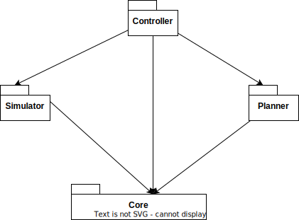
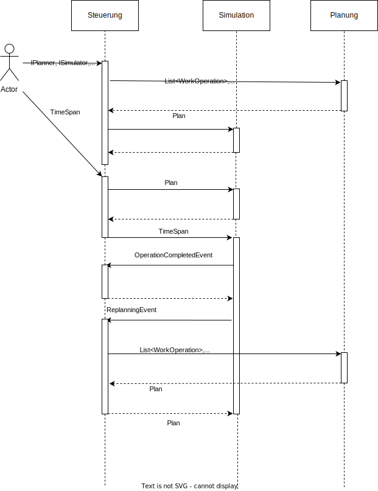

[Zurück zur Gliederung](../../readme.md)

<br />

# Architektur

- [Allgemeiner Aufbau der Bibliothek](#allgemeiner-aufbau-der-bibliothek)
  - [Sequenzdiagramm der Kernkomponenten](#sequenzdiagramm-der-kernkomponenten)
  - [Architekturentscheidungen](#architekturentscheidungen)
- [Beschreibung der wichtigsten Klassen](#beschreibung-der-wichtigsten-klassen)
  - [SimulationController](#simulationcontroller)
  - [CustomerOrderGenerator](#customerordergenerator)
  - [Planner](#planner)
  - [Simulationsereignisse](#simulationsereignisse)
  - [Services](#services)
  - [Simulator](#simulator)
  - [MachineModel](#machinemodel)
  - [InferenceModel](#inferencemodel)
- [Klassendiagramm der wichtigsten Klassen](#klassendiagramm-der-wichtigsten-klassen)

## Allgemeiner Aufbau der Bibliothek



Der hier gezeigte Aufbau der Pakete spiegelt im groben die zugrundeliegende Architektur der gesamten Bibliothek wieder. Während sich im **Core** vor allem Hilfsklassen und Klassen des Domänenmodells wiederfinden, besteht der **Simulator** aus jenen Klassen, die die Simulation selbst abbilden und das eingangs erwähnte `SimSharp`-Framework nutzen. Der Simulator enthält außerdem eine Testklasse, die es dem Nutzer ermöglicht, die Simulation auszuführen. Hierfür wurde seitens der Bibliothek eine Konfigurationsklasse bereitgestellt.

Innerhalb des **Planners** befindet sich die Planungslogik, z.B. [Giffler Thompson Planungsalgorithmus](https://www.jstor.org/stable/2583918).

Als zentrales Steuerungsmodul tritt der **Controller** auf. Dieser ist jedoch innerhalb der Bibliothek als fast leere Hülle zu verstehen, da der Controller selbst nur ein Delegate bereitstellt, das es außerhalb liegenden Klassen ermöglicht, Logik innerhalb des Controllers auszuführen.

Zu den hier aufgeführten Kernkomponenten gesellen sich noch weitere Komponenten, die vor allem der Simulation dienlich sind. Zum Beispiel existiert ein Generator Package, dass es dem Nutzer ermöglicht, Kunden sowie Aufträge dieser zufällig generieren zu lassen. Ebenso existieren Services, die es ermöglichen, Realdaten aus einer Produktion für die Nutzung in der Simulation bereitzustellen. Diese Services sind jedoch sehr rudimentär implementiert und müssen vor Gebrauch auf die eigenen Anforderungen angepasst werden.

### Sequenzdiagramm der Kernkomponenten



### Architekturentscheidungen

1. Die gesamte Bibliothek ist in einzelne Komponenten unterteilt sowie jede Komponente in einen **Abstraction** und einen **Implementation** Teil.

2. Der Simulator kapselt vollständig das benutze Simulationsframework.

3. Planner und Controller sind vollständig austauschbar oder im Verhalten veränderbar.

Die getroffenen Entscheidungen dienen allem voran den Zielen der Wartbarkeit, Codequalität und Veränderbarkeit bzw. Flexibilität der Bibliothek.

Änderungen an einer Implementierung betreffen immer nur die konkrete Komponenten-Assembly. Durch die Kleinteiligkeit des Codes sind Anpassungen leichter durchführbar.

## Beschreibung der wichtigsten Klassen

### SimulationController

[Link zum Code](../../Controller.Implementation/SimulationController.cs)

Die Klasse des Simulation Controller ist eine Implementierung eines [IControllers](../../Controller.Abstraction/IController.cs). Die Verantwortlichkeit dieser Klasse beschränkt sich auf die Steuerung des Planungs- und Simulationsprozesses. Außerdem wird in dieser Klasse die Rückmeldungen (Feedbacks) der einzelnen simulierten Arbeitsgänge realisiert. Der Controller hält Referenzen auf einen [ISimulator](../../ProcessSimAbstraction/Domain/Interfaces/ISimulator.cs) und auf die abstrakte Klasse des [Planners](../../Planner.Abstraction/Planner.cs).

Mit Hilfe des HandleEvent Delegates kann das Reaktionsverhalten auf Unterbrechungen bzw. auf jede Art von Event gelauscht werden. Durch die konkrete Implementierung dieses Delegate wird das Reaktionsverhalten des Controllers und damit auch der gesamten Simulation gesteuert. Das [ProductionScenario](../../ProcessSimulator/Scenarios/ProductionScenario.cs) enthält bereits eine Standardimplementierung eines solchen Eventhandlers. Dem Nutzer steht es frei, diese Funktion nach belieben zu erweitern.

Eine genauere Beschreibung dieser Klasse ist im Kapitel [Implementierung eines Steuerungsalgorithmus (Controller)](implementation.md#implementierung-eines-steuerungsalgorithmus-controller) zu finden.

### CustomerOrderGenerator

[Link zum Code](../../Generators.Implementation/CustomerOrderGenerator.cs)

Die Klasse des CustomerOrderGenerator erlaubt die zufällige Erstellung von Kundenaufträgen. Basierend auf einer Liste von Kunden und deren Bestellthäufigkeitsverteilung ist diese Klasse in der Lage, eine Liste von Kundenaufträgen zu generieren, die auf der zuvor bereitgestellten Häufigkeitsverteilung basiert. Mit Hilfe des [OrderGenerator](../../Generators.Implementation/OrderGenerator.cs) ist es dann möglich, dass jedem Kunden zufällig eine Anzahl von Produkten zugewiesen wird und so entsprechende Kundenaufträge generiert werden können.

### Planner

[Link zum Code](../../Planner.Abstraction/Planner.cs)

Diese abstrakte Klasse beschreibt die Grundanforderungen an einen Planer für diese Bibliothek. Es wird eine Methode zum Planen, extern wie intern sowie eine Validierungsmethode bereitgestellt. Der konkrete Planer wie z.B. der [GifflerThompsonPlanner](../../Planner.Implementation/GifflerThompsonPlanner.cs) implementieren anschließend den Planungsalgorithmus.

Eine genauere Beschreibung dieser Klasse ist im Kapitel [Die abstrakte Klasse `Planner`](implementation.md#die-abstrakte-klasse-planner) zu finden.

### Simulationsereignisse

[Link zum Code](../../Core.Implementation/Events/)

Die Bibliothek bietet bereits eine Vielzahl von eigenen Ereignissen an, die von dem Controller ausgewertet werden können.

Im Moment gibt es die folgenden Ereignisse:

- `InterruptionEvent`: Dieses Ereignis wird generiert, wenn eine oder mehrere Maschinen ausfallen bzw. unterbrochen werden und nicht mehr arbeiten können. Es enthält die Maschinen, die ausgefallen sind.
- `InterruptionHandledEvent`: Dieses Ereignis wird generiert, wenn eine Maschine, die zuvor ausgefallen war, wieder arbeiten kann. Es enthält die Maschine, die jetzt wieder arbeiten kann.
- `OperationCompletedEvent`: Dieses Ereignis wird generiert, wenn ein Arbeitsgang abgeschlossen ist. Es enthält den abgeschlossenen Arbeitsgang und die Werte der Einflussfaktoren zum Startzeitpunkt des Arbeitsgangs.
- `OrderGenerationEvent`: Dieses Ereignis wird generiert, wenn neue Aufträge generiert werden sollen. Der Steuerungsalgorithmus kann dann auf dieses Ereignis reagieren, indem er die neuen Aufträge generiert und ihre Arbeitsgänge plant.
- `ReplanningEvent`: Dieses Ereignis wird generiert, wenn eine regelmäßige Neuplanung aller Arbeitsgänge stattfinden soll.

Eine genauere Beschreibung dieser Ereignisse ist im Kapitel [Simulationsereignisse](implementation.md#simulationsereignisse) zu finden.

### Services

Der Bibliothek stehen eine Vielzahl von Services zur Verfügung. Diese bieten vor allem den Zugang zu strukturierten Daten wie JSON oder CSV Dateien oder bilden das integrierte Reporting ab. Um neue Strukturen der Simulation mitzugeben, wird ein neuer Provider auf Basis des [IEntityLoader](../../Core.Abstraction/Services/IEntityLoader.cs) Interfaces benötigt. Unabhängig der eigentlichen Datenstruktur (z.B. XML, JSON, CSV) kann der [IEntityLoader](../../Core.Abstraction/Services/IEntityLoader.cs) einem [ProductionScenario](../../ProcessSimulator/Scenarios/ProductionScenario.cs) mitgegeben und geladen werden. Das Interface ist generisch und erwartet als Typargument den aus der Datei ladbaren Typen.

#### Beispiel

Um aus einer JSON File eine WorkPlan Repräsentation laden zu können, muss eine Klasse implementiert werden, die das [IEntityLoader](../../Core.Abstraction/Services/IEntityLoader.cs) Interface wie folgt implementiert:

```csharp
public class WorkPlanProviderJson : IEntityLoader<WorkPlan>
```

Wie man sehen kann, wird der Typ der Datei dem Interface mitgegeben, so dass die Load() Methode den korrekten Rückgabetypen erhält.

Alle Provider-Klassen sind nach diesem Schema aufgebaut.

Neben der Serviceklassen die sich innerhalb des Core Packages verbergen, gibt es noch eine Service Komponente, die es dem Nutzer ermöglicht, Realdaten in die Simulation zu laden. Dabei wurde sich am ETL Prozess für Data Warehouses orientiert und so Komponenten wie der [Extractor](../../Extractor.Implementation/CsvExtractor.cs) und der [Transformator](../../Transformer.Implementation/FromRealToSimulationMachineTransformer.cs) geschaffen. Beide Klassen implementieren ein Interface, das die reale Implementierung abstrahiert.

Die Integration von Realdaten in die Simulation wurde nicht abschließend in die Bibliothek implementiert und bedarf einer weiteren Überarbeitung bzw. es muss mit Fehlern gerechnet werden.

### Simulator

[Link zum Code](../../SimpleProcessSim/Simulator.cs)

Der Simulator ist die Abstraktion der Bibliothek gegenüber dem verwendeten Simulationsframework SimSharp. Mit Hilfe des [ISimulator](../../ProcessSimAbstraction/Domain/Interfaces/ISimulator.cs) Interfaces können beliebige Simulationsframeworks benutzt bzw. getauscht werden.

Zusammengefasst dient der Simulator als ausführende Klasse für die darüberliegenden Klassen Controller und Planner, da es für die Wartbarkeit unabdingbar ist, dass diese Klassen keinen direkten Zugriff auf simulationsrelevante Klassen haben.

Eine genauere Beschreibung dieser Klasse ist im Kapitel [`Simulator`](implementation.md#simulator) zu finden.

### MachineModel

[Link zum Code](../../SimpleProcessSim/Core/SimulationModels/MachineModel.cs)

Dies ist das zentrale Simulationsmodell auf Basis von SimSharp. In dieser Klasse wird der gesamte Simulationsprozess auf einer Maschine abgebildet. Die Klasse repräsentiert eine reale Maschine sowie die darauf stattfindenden Prozesse, wie z.B. die Bearbeitung von Arbeitsgängen, das Behandeln von Unterbrechungen und das Umrüsten auf andere Werkzeuge.

Eine genauere Beschreibung dieser Klasse ist im Kapitel [`MachineModel`](implementation.md#machinemodel) zu finden.

### InferenceModel

Als Teil des ausführenden [ProcessSimulator](../../ProcessSimulator/Main.cs) stellt das InferenceModel das Modell bereit, das genutzt wird um einen Duration Factor zu ermitteln. Hierbei handelt es sich um die Implementierung des Microsoft ML Pacakges [Infer.Net](https://dotnet.github.io/infer/). In der aktuellen Implementierung wird dieses Modell nicht genutzt, sondern ein Modell auf Basis von Python geladen.

Eine genauere Beschreibung dieser Klasse ist im Kapitel [Stetige Modelle](application.md#stetige-modelle) zu finden.

## Klassendiagramm der wichtigsten Klassen


Das Klassendiagramm zeigt alle relevanten Klassen, die für die Simulation einer Produktion notwendig sind. Es werden die Abhängigkeiten und Zusammenhänge von Kunden, Kundenaufträgen, Produktionsaufträgen, Arbeitsplänen, Arbeitsgängen, Maschinen und Werkzeug dargestellt. Dieses Klassendiagramm ist vor allem für das allgemeine Verständnis der Bibliothek zu verstehen und bietet einen Überblick über die verwendeten Klassen und deren Abhängigkeiten.

Die Farbcodierung soll zusammengehörige Domänenobjekte markieren und so der Übersichtlichkeit und Verständlichkeit des Diagramms beitragen.

Die Pfeile repräsentieren Abhängigkeiten der Klassen untereinander.

<br />
<br />

[Zurück zur Gliederung](../../readme.md)
