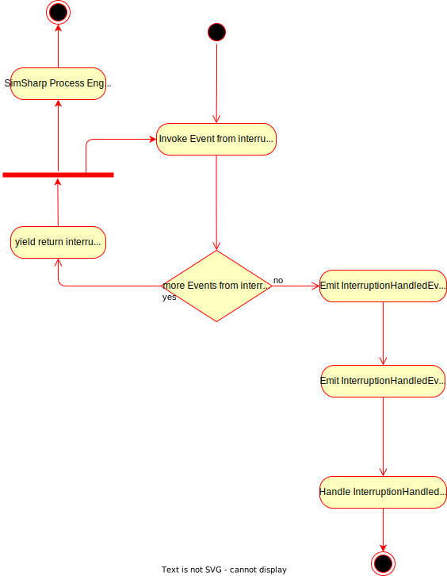

[Zurück zur Gliederung](../../readme.md)

<br />

# Implementierung der Simulationsbibliothek

-   [Implementierung des Simulationskerns](#implementierung-des-simulationskerns)
    -   [Simulationsprozesse](#simulationsprozesse)
    -   [`Simulator`](#simulator)
    -   [`MachineModel`](#machinemodel)
    -   [Simulationsereignisse](#simulationsereignisse)
-   [Implementierung eines Planungsalgorithmus](#implementierung-eines-planungsalgorithmus)
    -   [Die abstrakte Klasse `Planner`](#die-abstrakte-klasse-planner)
    -   [Beispielhafte Implementierung eines Planungsalgorithmus](#beispielhafte-implementierung-eines-planungsalgorithmus)
-   [Implementierung eines Steuerungsalgorithmus (Controller)](#implementierung-eines-steuerungsalgorithmus-controller)
-   [Rückmeldungen](#rückmeldungen)
-   [Reporting-Features](#reporting-features)
-   [Implementierung eines Standardszenarios](#implementierung-eines-standardszenarios)

## Implementierung des Simulationskerns

Der Simulationskern ist das Herzstück der Simulationsbibliothek. Er enthält die Klassen, die für die Simulation benötigt werden, konkret den `Simulator` und das `MachineModel`. Diese Klassen verwenden die Bibliothek `SimSharp`, um ereignisbasiert eine Produktion zu simulieren. Die Klasse `Simulator` ist für die Koordination der gesamten Simulation verantwortlich, während in der Klasse `MachineModel` die Vorgänge auf einer Maschine modelliert werden.

Durch Verwendung des Interfaces [ISimulator](../../ProcessSimAbstraction/Domain/Interfaces/ISimulator.cs) ist es auch möglich, eine eigene Implementierung des Simulators zu erstellen, die beispielsweise auf einem anderen Simulationsframework basiert. Die Klasse `Simulator` ist aber die Standardimplementierung, die bereits in der Simulationsbibliothek enthalten ist. Im Folgenden wird diese Standardimplementierung genauer beschrieben.

### Simulationsprozesse

Bevor tiefer in die Implementierung der Klassen eingestiegen wird, ist es wichtig, zu verstehen, wie SimSharp funktioniert. SimSharp ist ein Simulationsframework, das auf ereignisbasierter Simulation basiert. Das bedeutet, dass die Simulation durch das Emittieren von Ereignissen gesteuert wird. Jedes Ereignis beinhaltet dabei unter anderem einen Zeitpunkt, zu dem es abgearbeitet wird. Möchte man nun mit Hilfe von SimSharp eine Simulation durchführen, benötigt man eine Instanz der Klasse `Simulation`. Dieses Objekt hält unter anderem die sogenannte "Event Queue" (Warteschlange der abzuarbeitenden Ereignisse) und kümmert sich darum, diese Ereignisse abzuarbeiten. 

Die SimSharp-Ereignisse sind dabei zu unterscheiden von den Ereignissen, die in der Simulationsbibliothek emittiert werden und welche im Kapitel [Simulationsereignisse](#simulationsereignisse) beschrieben werden. Letztere steuern nicht die Simulation selbst, sondern dienen dazu, den Steuerungsalgorithmus über den aktuellen Stand der Simulation zu informieren.

Ein Prozess, der mit Hilfe einer `Simulation`-Instanz simuliert werden soll, wird mittels der Methode `Process` registriert. Ein solcher Prozess ist eine **Generator-Funktion**, die eine Sammlung von Ereignissen (bspw. `IEnumerable<SimSharp.Event>`) zurückgibt. Dies wird in C# realisiert, indem eine Funktion per `yield return` ein  `Event` zurückgibt.

Beispielsweise kann mit Hilfe der Methode `Timeout` der Klasse `Simulation` wie folgt:

```csharp
yield return sim.Timeout(TimeSpan.FromHours(8));
```

ein Ereignis an die Event Queue übergeben werden, das besagt, dass dieser Prozess 8 Stunden lang pausiert. Dabei wird die Ausführung des Prozesses an dieser Stelle unterbrochen, kann aber (anders als bei einem normalen `return`) später an dieser Stelle fortgesetzt werden. Dies übernimmt die `Simulation`-Instanz von SimSharp.

Wenn die Simulation mittels der `Run`-Methode der `Simulation`-Instanz gestartet wird, werden die Prozesse abgearbeitet und die Ereignisse, die sie emittieren, werden abgearbeitet. Dabei wird die Simulation so lange fortgesetzt, bis entweder keine weiteren Ereignisse mehr in der Event Queue sind oder die festgelegte Dauer der Simulation abgelaufen ist.

Solche Simulationsprozesse werden im Rahmen der Simulationsbibliothek in den Klassen `Simulator` und `MachineModel` verwendet, um die Simulation zu steuern. Sie finden dabei unter anderem Anwendung beim Simulieren von Vorgängen auf Maschinen, beim regelmäßigen Neuplanen von Arbeitsgängen, beim regelmäßigen Generieren neuer Aufträge und beim Auslösem von Unterbrechungen. Das Verständnis von Generator-Funktionen in C# und somit der verwendeten Prozesse ist daher essenziell, um die Funktionsweise der Simulationsbibliothek zu verstehen.

### `Simulator`

Der [Simulator](../../SimpleProcessSim/Simulator.cs) gibt die Anweisungen des Steuerungsalgorithmus an das darunter liegende Simulationsframework weiter und ist für die Erstellung und Verwaltung der Simulationsressourcen (z.B. Maschinen) zuständig. Innerhalb des Simulators werden auch die notwendigen Monitore für die Überwachung der jeweiligen Resourcen angelegt.

Der `Simulator` wird mit einem Seed und einem Startzeitpunkt initialisiert. Über öffentliche Properties können unter anderem das Intervall für die regelmäßige Neuplanung der Arbeitsgänge (`ReplanningInterval`), der Steuerungsalgorithmus als EventHandler (`SimulationEventHandler`) und die Einflussfaktoren für die Simulation (`InfluencingFactors`) konfiguriert werden.

Für die Simulation benötigte Ressourcen wie beispielsweise Maschinen oder Werkzeuge können über die Methode `CreateSimulationResource` hinzugefügt werden. Diese Methode kann im Moment nur für Maschinen verwendet werden, da Werkzeuge und andere Ressourcen noch nicht komplett generisch implementiert sind. Für Maschinen wird ein `MachineModel`-Objekt erstellt und einige Monitore für die Überwachung der Maschine angelegt. Die Maschine wird dann in eine `Dictionary` gespeichert, das das Domänen-Objekt (hier `Machine`) dem Simulationsmodell (hier `MachineModel`) zuordnet. Außerdem wird dem `MachineModel` ein EventHandler zugewiesen, der aus der Maschine emittierte Ereignisse behandelt. Dies ist die Methode `InvokeSimulationEvent`. Bei Erstellung des `MachineModel` wird auch ein SimSharp-Prozess registriert, der die Vorgänge auf der Maschine simuliert. (Siehe [MachineModel](#machinemodel))

Die Methode `InvokeSimulationEvent` ruft für jedes Ereignis den konfigurierten `SimulationEventHandler` auf und übergibt das aufgetretene Ereignis somit an den Steuerungsalgorithmus. Weiterhin kann hier auch noch spezielle Logik für das Behandeln bestimmter Ereignisse innerhalb der Simulation untergebracht werden. Im Moment behandelt die Methode zusätzlich noch speziell das `OperationCompletedEvent`, indem der Status des Arbeitsgangs aktualisiert wird und der Nachfolger-Arbeitsgang laut Arbeitsplan auf seiner Maschine in die Warteschlange eingereiht wird (mittels der `ExecuteOperation`-Methode).

Wenn in der Simulation Unterbrechungen auftreten sollen, können diese über die Methode `AddInterrupt` hinzugefügt werden. Sie registriert einen Simulationsprozess bei der `Simulation`-Instanz von SimSharp, der die Unterbrechungen auslöst. Dieser Prozess löst in einer Endlosschleife Unterbrechungen aus, die in einem konfigurierten (auch zufälligen) Intervall auftreten sollen. Die betroffenen Maschinen werden anhand einer übergebenen Funktion ausgewählt, die die Maschinen auswählt, die unterbrochen werden sollen. Die zu diesen Maschinen gehörenden Simulationsprozesse werden mit 
```csharp 
machineModel.Process.Interrupt(interruptAction);
```
unterbrochen. Im Anschluss wird mittels der `InvokeSimulationEvent`-Methode ein `InterruptionEvent` an den Controller emittiert.

Das Argument `interruptAction` bei dem Aufruf oben ist dabei eine vom Nutzer definierte Generator-Funktion (und somit ein Simulationsprozess), die die Vorgänge während der Unterbrechung simuliert. Das kann beispielsweise das Warten auf die Reparatur einer Maschine oder auf das Ende eines Stromausfalls sein. Wenn diese Funktion keine weiteren Ereignisse mehr emittiert, gilt die Unterbrechung als beendet und die Maschine wird wieder in den normalen Betrieb versetzt. Dazu wird im `MachineModel` ein `InterruptionHandledEvent` emittiert, das an den Controller weitergegeben wird.

Ähnlich wie die Unterbrechungen können mit Hilfe der Methode `AddOrderGeneration` Simulationsprozesse registriert werden, die entsprechend einer mit übergebenen Verteilung für die Dauer zwischen den Generierungen von Aufträgen ein `OrderGenerationEvent` emittieren. Dieses Event wird dann an den Controller weitergegeben, der auf dieses Event reagieren kann, indem er neue Aufträge generiert.

Die Methode `Start` startet die Simulation für eine bestimmte Dauer. Zuvor registriert sie noch den Simulationsprozess, der regelmäßig ein `ReplanningEvent` emittiert, um die regelmäßige Neuplanung der Arbeitsgänge zu steuern. Außerdem werden die Prozesse für die Simulation von externen Einflussfaktoren registriert.

Zu guter Letzt bietet der `Simulator` noch die Möglichkeit für den Steuerungsalgorithmus, einen neuen Plan für die Arbeitsgänge zu setzen. Die Methode `SetCurrentPlan` setzt den aktuellen Plan für die Simulation und kümmert sich darum, dass Arbeitsgänge, die jetzt ausgeführt werden können und noch nicht gestartet wurden, auf der ihnen zugeordneten Maschine gestartet werden. Dazu wird die `ExecuteOperation`-Methode verwendet. 
Außerdem werden Arbeitsgänge, die bereits in der Warteschlange einer Maschine sind (aber deren Bearbeitung noch nicht gestartet wurde), aus dieser Warteschlange entfernt und in die Warteschlange der Maschine eingereiht, auf der sie laut dem neuen Plan jetzt bearbeitet werden sollen. (Natürlich nur, wenn die Maschine nicht die gleiche ist, auf der sie bereits warten.) 
Arbeitsgänge, die bereits auf einer Maschine in der Warteschlange eingereiht sind, aber in dem neuen Plan gar nicht mehr vorhanden sind, werden ebenfalls aus der Warteschlange der Maschine entfernt. 

### `MachineModel`

Das [MachineModel](../../SimpleProcessSim/Core/SimulationModels/MachineModel.cs) ist das zentrale Simulationsmodell auf Basis von SimSharp. In dieser Klasse wird der gesamte Simulationsprozess auf einer Maschine abgebildet.

Die Klasse `MachineModel` bietet einige Methoden zum Steuern der Warteschlange der Arbeitsgänge, die auf der Maschine noch ausgeführt werden sollen:
- `EnqueueOperation` fügt einen Arbeitsgang in die Warteschlange der Maschine an die entsprechende Stelle ein, an der er ausgeführt werden soll. Danach muss eventuell der Simulationsprozess unterbrochen werden, falls er sich im Idle-Zustand befindet. So wird sichergestellt, dass der Arbeitsgang auch wirklich rechtzeitig bearbeitet wird. Würde das nicht getan, würde der Prozess eventuell zu lange im Idle-Zustand verweilen und der Arbeitsgang würde nicht rechtzeitig bearbeitet werden.
- `RemoveOperation` entfernt einen Arbeitsgang aus der Warteschlange der Maschine. Auch hier muss im Anschluss eventuell der Simulationsprozess unterbrochen werden, falls er sich im Idle-Zustand befindet. Dies ist notwendig, falls beispielsweise der Arbeitsgang entfernt wurde, der als nächstes ausgeführt werden sollte. In diesem Fall muss der Prozess unterbrochen werden, um den neuen nächsten Arbeitsgang zu starten.
- `IsQueued` gibt an, ob ein Arbeitsgang in der Warteschlange der Maschine eingereiht ist.

Diese Methoden werden hauptsächlich vom `Simulator` verwendet, um die Warteschlange der Maschine zu steuern. Der `Simulator` ruft beispielsweise die `EnqueueOperation`-Methode auf, wenn ein neuer Plan für die Arbeitsgänge gesetzt wird und ein neuer Arbeitsgang auf der Maschine bearbeitet werden soll.

Im Konstruktor wird der Simulationsprozess registriert, der die Vorgänge auf der Maschine simuliert. Dies ist konkret die Generator-Funktion `Work`.

Innerhalb der `Work`-Methode werden alle Zustände der Maschine abgebildet. In einer Endlosschleife werden immer wieder die folgenden Zustände durchlaufen:

- Idle-Zustand: Die Maschine ist eingeschaltet und bereit, aber arbeitet nicht, weil beispielsweise kein Arbeitsgang in der Warteschlange ist oder weil der nächste Arbeitsgang laut Plan erst später bearbeitet werden soll.
- ChangeOver-Zustand: Die Maschine rüstet gerade um (Wechsel von Werkzeug, Material etc.) oder ist mit dem Umrüsten bereits früher fertig und wartet noch, bevor der nächste Arbeitsgang bearbeitet wird.
- ProcessOrder-Zustand: Die Maschine bearbeitet den aktuell auf der Maschine liegenden Arbeitsgang.
- HandleInterrupt-Zustand: Die Maschine wurde durch äußere Umstände unterbrochen (z.B. Defekt, Personalmangel, Schichtende, Stromausfall etc.) und diese Unterbrechung wird im Moment behandelt.

Jeder dieser Zustände ist als eigene Generator-Funktion implementiert, die eine Sammlung von Ereignissen (also `IEnumerable<SimSharp.Event>`) zurückgibt. Die `Work`-Funktion iteriert über diese Ereignisse und gibt diese einfach per `yield return` an die `Simulation`-Instanz von SimSharp zurück. Die `Simulation`-Instanz kümmert sich dann darum, diese Ereignisse abzuarbeiten und die `Work`-Funktion an der Stelle, an der das `yield return` auftritt, zu unterbrechen und später fortzusetzen. So kann beispielsweise nach Beendigung des Idle-Zustands, falls notwendig, die `ChangeOver`-Funktion aufgerufen werden, die dann wiederum die Ereignisse für den ChangeOver-Zustand zurückgibt.

Nach Beendigung des ProcessOrder-Zustands wird ein `OperationCompletedEvent` emittiert, das an den `Simulator` und von dort aus weiter an den Steuerungsalgorithmus weitergegeben wird.

Im Folgenden soll die `HandleInterrupt`-Methode genauer betrachtet werden. Diese Methode ist besonders klein und gut lesbar, jedoch steckt eine nicht zu unterschätzende Komplexität in ihr. Sie ist ein gutes Beispiel für die Verwendung von Generator-Funktionen in C# und die Verwendung von SimSharp. 

```csharp
   private IEnumerable<Event> HandleInterrupt(Func<ActiveObject<Simulation>, IEnumerable<Event>> interruptAction)
        {
            foreach (var interruptEvent in interruptAction.Invoke(this))
                yield return interruptEvent;

            SimulationEventHandler?.Invoke(this, new InterruptionHandledEvent(Environment.Now, _machine));
            lastInterruptEndTime = Environment.Now;
        }
```

Es handelt sich hierbei um eine klassische Generator-Funktion in C#. Das übergebene Argument ist, wie bereits weiter oben erwähnt, ebenfalls eine Generator-Funktion, die die Vorgänge auf der Maschine während der Unterbrechung simuliert. Sie wird hier aufgerufen und bekommt als Argument das `MachineModel` übergeben, sodass sie auf die Eigenschaften und Methoden des `MachineModel` und der dazugehörigen Maschine zugreifen kann. Mit Hilfe der `ForEach`-Schleife werden nacheinander alle in der `interruptAction` enthaltenen Events nach außen emittiert. Möglich macht dies das `yield`-Keyword. Diese Events werden entsprechend von der SimSharp-Simulationsumgebung abgehandelt, wenn die Simulationszeit bis zu dem Event fortgeschritten ist. Immer wenn ein Ereignis behandelt wurde und die SimSharp-Simulationsengine den Prozess fortsetzt, wird die Ausführung der Methode an der gleichen Stelle fortgesetzt, an der sie zuvor, beim letzten `yield`-Statement, unterbrochen wurde.

Nach dem alle Events der `interruptAction` nach außen gegeben wurden, wird der `SimulationEventHandler` des `MachineModel` aufgerufen. Über diesen wird nun das `InterruptionHandledEvent` an den Simulator weitergegeben, dieser gibt das Event weiter an den Controller und das dort hinterlegte Delegate, das durch das ProductionScenario implementiert wurde, behandelt das Event.



Ähnlich sind ebenfalls die Methoden `Idle`, `ChangeOver` und `ProcessOrder` aufgebaut. Dank dieses Patterns konnte der relevante Code für die Vorgänge in den Zuständen jeweils in eine eigene dafür vorgesehene Methode ausgelagert werden und somit die Komplexität der `Work`-Methode reduziert werden.

Weitere Vereinfachungen könnten in der `ChangeOver`-Methode realisiert werden, da diese im Moment noch durch die Vielzahl von Randfällen und Verzweigungen etwas unübersichtlich und schwerer zu verstehen ist.

Im `MachineModel` sind außerdem einige Monitore enthalten, die einige Statistiken der Maschine überwachen. Sie werden vom `Simulator` bei der Erstellung des `MachineModel` angelegt und überwachen beispielsweise die Auslastung der Maschine, die Länge der Warteschlange und die Wartezeit. Dazu werden in SimSharp enthaltene Interfaces genutzt, konkret `ITimeSeriesMonitor` und `ISampleMonitor`. Die entsprechenden Werte werden an den jeweiligen Stellen im Pozess der Maschine aktualisiert. Der `Simulator` kann dann auf diese Monitore zugreifen und die Werte auslesen, um beispielsweise nach Simulationsende eine Auswertung der Simulation zu ermöglichen.

### Simulationsereignisse

Während der Simulation werden regelmäßig Ereignisse vom `Simulator` emittiert, die von der Steuerung (Controller) verarbeitet werden. Alle Ereignisse werden über einen C#-EventHandler aus dem `Simulator` an den `Controller` übergeben. Jedes Ereignis erbt daher von der Klasse `EventArgs` und enthält den Zeitpunkt, zu dem es aufgetreten ist.

Im Moment gibt es die folgenden Ereignisse:

- `InterruptionEvent`: Dieses Ereignis wird generiert, wenn eine oder mehrere Maschinen ausfallen bzw. unterbrochen werden und nicht mehr arbeiten können. Es enthält die Maschinen, die ausgefallen sind.

- `InterruptionHandleEvent`: Dieses Ereignis wird generiert, wenn eine Maschine, die zuvor ausgefallen war, wieder arbeiten kann. Es enthält die Maschine, die jetzt wieder arbeiten kann. Es wird in der Klasse `MachineModel` generiert, wenn die Behandlung einer Unterbrechung einer Maschine beendet ist.

- `OperationCompletedEvent`: Dieses Ereignis wird generiert, wenn ein Arbeitsgang abgeschlossen ist. Es enthält den abgeschlossenen Arbeitsgang und die Werte der Einflussfaktoren zum Startzeitpunkt des Arbeitsgangs.

- `OrderGenerationEvent`: Dieses Ereignis wird generiert, wenn neue Aufträge generiert werden sollen. Der Steuerungsalgorithmus kann dann auf dieses Ereignis reagieren, indem er die neuen Aufträge generiert und ihre Arbeitsgänge plant. In der Standardimplementierung im [ProductionScenario](../../ProcessSimulator/Scenarios/ProductionScenario.cs) werden bei diesem Event nicht nur die Produktionsaufträge generiert, sondern ihre Arbeitsgänge auch gleich eingeplant, sodass ihre Bearbeitung sofort beginnen kann. Dieses Verhalten kann durch den Nutzer im `ProductionScenario` angepasst oder durch einen eigenen Steuerungsalgorithmus ersetzt werden.

- `ReplanningEvent`: Dieses Ereignis wird generiert, wenn eine regelmäßige Neuplanung aller Arbeitsgänge stattfinden soll. Es wird in Abhängigkeit der konfigurierten Häufigkeit immer nach einem gewissen Zeitraum ausgelöst. Dieses Event bildet den regelmäßigen Planungslauf einer echten Produktion ab. Es wird auch emittiert, wenn beispielsweise aufgrund von Unterbrechungen oder anderen Ereignissen erst kurz zuvor neu geplant wurde. 

## Implementierung eines Planungsalgorithmus

Für die korrekte Ausführung der Simulation wird ein Plan benötigt, nach dem die Arbeitsgänge bearbeitet werden sollen. Dieser Plan wird von einem Planungsalgorithmus erstellt. Jeder Planungsalgorithmus muss von der abstrakten Klasse [Planner](../../Planner.Abstraction/Planner.cs) erben und somit die Methode `ScheduleInternal` implementieren.

### Die abstrakte Klasse `Planner`

Die Klasse `Planner` enthält grundlegende Funktionalität, die jeder Planungsalgorithmus benötigt.
Sie stellt eine öffentliche Methode `Schedule` bereit, die beispielsweise von der Steuerung (Controller) aufgerufen werden kann, wenn Arbeitsgänge geplant werden sollen. Diese Methode erhält die Liste der zu planenden Arbeitsgänge, die Liste der Maschinen, auf denen diese eingeplant werden sollen, und die Startzeit, zu der der Plan beginnen soll. Sie ruft die abstrakte Methode `ScheduleInternal` auf, die von den konkreten Implementierungen überschrieben werden muss, die gleichen Parameter wie die `Schedule`-Methode erhält und ein Objekt vom Typ `Plan` zurück gibt. Anschließend wird dieses `Plan`-Objekt mit Hilfe der Methode `ValidatePlan` überprüft und zurückgegeben.

Die Klasse `Plan` enthält einfach eine Liste von Arbeitsgängen (`WorkOperation`), wobei das Enthaltensein eines Arbeitsgangs in der Liste bedeutet, dass dieser Arbeitsgang in der Simulation eingeplant ist. Das heißt, dass die Properties `PlannedStart`, `PlannedFinish` und `Machine` der `WorkOperation` vom Planungsalgorithmus gesetzt wurden. Ein `Plan` kann auch unvollständig sein, was über die Property `IsComplete` signalisiert wird. Ein unvollständiger Plan entsteht, wenn nicht alle Arbeitsgänge eingeplant werden konnten, die an den Planungsalgorithmus übergeben wurden, weil beispielsweise von einem bestimmten Maschinentyp im Moment keine Maschine läuft. (Dies kann beispielsweise bei Unterbrechungen dieser Maschinen der Fall sein.) Dann können manche Arbeitsgänge nicht eingeplant werden und der Plan ist unvollständig.

Die Methode `ValidatePlan` führt einige Überprüfungen durch, um sicherzustellen, dass der Plan korrekt ist. Sie prüft zum einen, dass nie zwei Arbeitsgänge auf der gleichen Maschine zur gleichen Zeit eingeplant sind und zum anderen, dass Arbeitsgänge, die zu einem Produkt gehören, auch in der richtigen Reihenfolge eingeplant sind, wenn sie nur nacheinander bearbeitet werden können. (Was bisher immer der Fall ist. Arbeitsgänge, die in einem Arbeitsplan aufeinander folgen, müssen auch in dieser Reihenfolge bearbeitet werden.)
Sollte eine dieser Bedingungen verletzt sein, wird eine Exception geworfen.

Von der Klasse `Planner` erbende Klassen müssen somit nur die Methode `ScheduleInternal` implementieren, die die eigentliche Planung durchführt. Die Klasse `Planner` kümmert sich um die Validierung des Plans.

### Beispielhafte Implementierung eines Planungsalgorithmus

Die Simulationsbibliothek stellt beispielhaft einen Planungsalgorithmus bereit, der bisher für alle Use Cases ausreichte. Konkret wurde in der Klasse [GifflerThompsonPlanner](../../Planner.Implementation/GifflerThompsonPlanner.cs) der Giffler-Thompson-Algorithmus implementiert.
Die Klasse erbt von `Planner` und implementiert die `ScheduleInternal`-Methode. Darin wird der Giffler-Thompson-Algorithmus ausgeführt. Sie setzt die entsprechenden Properties der `WorkOperation`-Objekt und hält eine Variable `isPlanComplete`, die zu Beginn `true` ist, aber auf `false` gesetzt wird, sobald ein Arbeitsgang angetroffen wird, der nicht eingeplant werden kann. Am Ende gibt sie ein `Plan`-Objekt zurück, welches alle eingeplanten Arbeitsgänge und die `isPlanComplete`-Flag enthält.

## Implementierung eines Steuerungsalgorithmus (Controller)

Der Controller ist das zentrale Steuerelement der Simulation. Er ist dafür verantwortlich, die Simulation zu starten und zu stoppen, auf Ereignisse zu reagieren und die Planung der Arbeitsgänge zu koordinieren. Es gibt ein Interface [IController](../../Controller.Abstraction/IController.cs), das nur die Methode `Execute(TimeSpan duration)` enthält, die von konkreten Implementierungen überschrieben werden muss. Diese Methode wird aufgerufen, um die Simulation zu starten und für eine bestimmte Dauer laufen zu lassen.

In der Simulationsbibliothek wurde bisher nur eine Steuerungskomponente implementiert, die sehr generisch gehalten ist. Konkret wurde in der Klasse [SimulationController](../../Controller.Implementation/SimulationController.cs) einige Funktionalität implementiert, die für die Steuerung der Simulation benötigt wird.
Dem Konstruktor werden die initial zu simulierenden Arbeitsgänge, die Maschinen, auf denen diese bearbeitet werden sollen, ein `Planner` (siehe [Implementierung eines Planungsalgorithmus](#implementierung-eines-planungsalgorithmus)) und ein `Simulator` (siehe [Simulator](#simulator)) übergeben. Der `Simulator` wird benötigt, um die Simulation zu starten und zu stoppen. Der `Planner` wird benötigt, um die Arbeitsgänge zu planen. Im Konstruktor werden dann unter anderem die Arbeitsgänge initial mittels des erhaltenen `Planner` geplant, sodass der `CurrentPlan` das erste Mal gesetzt wird. Außerdem wird eine Methode `SimulationEventHandler` für den `Simulator` registriert, die auf die Ereignisse der Simulation reagiert. Ihre Implementierung wird weiter unten genauer beschrieben. Weiterhin werden die erhaltenen Maschinen an den `Simulator` übergeben.

Die Methode `Execute` startet die Simulation für die übergebene Dauer. Sie setzt den initialen Plan der Arbeitsgänge für die Simulation und ruft den `Simulator` auf, die Simulation für diese Dauer zu starten.

Weiterhin gibt es in der Klasse `SimulationController`noch die Methode `SimulationEventHandler`. Diese Methode wird aufgerufen, wenn ein Ereignis in der Simulation auftritt (im `Simulator` wird dieser EventHandler aufgerufen). Hier wird nur auf ein `OperationCompletedEvent` reagiert, indem eine Rückmeldung für den abgeschlossenen Arbeitsgang erstellt wird.

Die Klasse `SimulationController` stellt abgesehen davon keinen richtigen Steuerungsalgorithmus bereit. Dieser muss vom Nutzer der Klasse über die öffentliche Property `HandleEvent` gesetzt werden, welche ein Delegate ist. In der Methode `SimulationEventHandler` wird nach dem (eventuellen) Erstellen eines Feedbacks dann dieses Delegate aufgerufen, wenn ein Ereignis auftritt.

Dieser Delegate erhält als Argumente das aufgetretene Ereignis, den aktuellen Plan, den konfigurierten `Planner` und den `Simulator`, sowie die Arbeitsgänge, die noch zu simulieren sind und solche, die bereits abgeschlossen wurden. In dem Delegate kann der Nutzer dann auf das Ereignis reagieren, indem er beispielsweise die Arbeitsgänge neu plant (mittels des `Planner`), wenn eine Maschine ausfällt, oder indem er bestimmte Logs ausgibt. (Eine beispielhafte Implementierung eines Steuerungsalgorithmus ist in [Implementierung eines Standardszenarios](#implementierung-eines-standardszenarios) etwas genauer beschrieben.)

## Rückmeldungen

Während der Simulation werden, immer wenn ein Arbeitsgang abgeschlossen ist, von der Klasse `SimulationController` (falls diese verwendet wird) Rückmeldungen (`ProductionFeedback`s) erstellt. Diese enthalten jeweils Informationen über den abgeschlossenen Arbeitsgang und werden in einer Liste gespeichert. Diese Liste kann dann nach Ende der Simulation beispielsweise für das Reporting (siehe [Reporting-Features](#reporting-features)) verwendet werden.

Die Klasse `ProductionFeedback` implementiert das Interface `IFeedback` welches auch für andere Arten von Rückmeldungen verwendet werden kann. Im Moment sind aber nur Rückmeldungen zu Arbeitsgängen implementiert. Die Klasse enthält Informationen über den abgeschlossenen Arbeitsgang, die Maschine, auf der er bearbeitet wurde, die Dauer, die er benötigt hat, die Zeit, zu der er abgeschlossen wurde und die aktuellen Werte der Einflussfaktoren in der Produktion zum Startzeitpunkt des Arbeitsgangs.

## Reporting-Features

Das Erstellen von Berichten ist essenziell für das REPLAKI-Projekt, da anhand dieser Berichte die Simulationsergebnisse ausgewertet werden können. Außerdem soll das Lernen von Modellen auf diesen Berichten ausgeführt werden. Die Simulationsbibliothek bietet daher eine Möglichkeit, Berichte zu erstellen und in Dateien mit verschiedenem Format zu speichern.

Diese Funktionalität ist in der Klasse [FeedbackWriter](../../Core.Implementation/Services/Reporting/FeedbackWriter.cs) implementiert. Sie bietet einige Methoden, um Feedbacks (siehe [Rückmeldungen](#rückmeldungen)) und Kundenaufträge, die während der Simulation generiert werden, in Dateien zu speichern. Die Klasse bietet die Möglichkeit, die Berichte in verschiedenen Formaten zu speichern, im Moment sind JSON und CSV implementiert.

Jeder Methode kann neben den zu speichernden Daten auch der Pfad übergeben werden, an dem die Datei gespeichert werden soll.

## Implementierung eines Standardszenarios

Ein Szenario stellt eine Abstraktionsebene dar, die die Nutzung der Simulationsbibliothek vereinfachen soll. Jedes Szenario implementiert das Interface [IScenario](../../ProcessSimAbstraction/Domain/Interfaces/IScenario.cs). Dabei wird (neben einigen Properties) grundsätzlich nur eine Methode `Run()` zum Starten der Simulation benötigt. Alles andere wird den einzelnen Implementierungen überlassen.

Derzeit gibt es in der Simulationsbibliothek nur ein Szenario, das aber bisher alle Use Cases abdeckt, die in den Anforderungen definiert wurden. Das [ProductionScenario](../../ProcessSimulator/Scenarios/ProductionScenario.cs) ist ein generisches Szenario, das die Simulation einer Produktion ermöglicht. Es können bei diesem Szenario einige Properties, unter anderem StartTime, Seed und Duration konfiguriert werden.

Außerdem bietet es eine Fluent-API, um die zentralen Objekte für die Simulation zu setzen: Controller (Steuerung), Planner (Planungsalgorithmus), Simulator, Datengeneratoren für Aufträge, Ressourcen (Maschinen, Werkzeuge), EntityLoader (Automatisches Laden von Ressourcen aus Dateien), Unterbrechungen, Reporting (Berichterstellung), Einflussfaktoren und noch einige andere. In der `Run`-Methode wird die Simulation und alle benötigten Objekte initialisiert, wobei für nicht vorher konfigurierte Objekte Standardimplementierungen verwendet werden. Für den Planner wird beispielsweise der [GifflerThompsonPlanner](../../Planner.Implementation/GifflerThompsonPlanner.cs) verwendet, der ebenfalls in der Simulationsbibliothek implementiert wurde. Anschließend startet die `Run`-Methode die Simulation und führt im Anschluss noch das Reporting durch.

Außerdem enthält das `ProductionScenario` eine Methode `SimulationEventHandler`, welche eine Standardimplementierung für einen Steuerungsalgorithmus bereitstellt. Dabei wird auf die von der Simulation generierten Events reagiert und entsprechend gehandelt. Bei Events, die den Beginn oder das Ende einer Unterbrechung signalisieren, wird entsprechend ohne (oder mit) der betroffenen Maschine neu geplant. Bei einem `OrderGenerationEvent` werden entsprechend der Konfiguration neue Aufträge generiert und mit ihren neuen Arbeitsgängen wird neu geplant. Bei einem `ReplanningEvent` wird ebenfalls neu geplant. Wenn ein `OperationCompletedEvent` auftritt, wird der entsprechende Arbeitsgang in die Liste der abgeschlossenen Arbeitsgänge eingetragen.

Zusätzlich bietet das `ProductionScenario` eine Methode `CollectStats`, die einige Statistiken aus der Simulation sammelt und ausgibt. Diese ist aber vom Reporting zu unterscheiden, bei dem richtige Berichte zu Vorgängen während der Simulation erstellt werden.

<br />
<br />

[Zurück zur Gliederung](../../readme.md)
