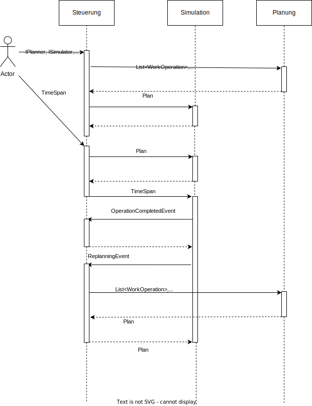

# Forschungs- und Entwicklungsprojekt "REPLAKI"

- [Einführung](#einfuhrung)
  * [Ziel](#ziel)
  * [Anforderungen](#anforderungen)
  * [Kurzbeschreibung](#kurzbeschreibung)
- [Konfiguration](#konfiguration)
  * [Maschinen](#maschinen)
  * [Werkzeuge](#werkzeuge)
  * [Arbeitspläne](#arbeitsplane)
- [Beispiel Anwendung in .NET](#beispiel-anwendung-in-net)
- [Beispiel Anwendung in Python](#beispiel-anwendung-in-python)
  * [Python-Anwendung im Detail](#python-anwendung-im-detail)
  * [Unterschiede zwischen Python und .NET](#unterschiede-python-net)
  * [Ausführen der Anwendung](#ausfuhren-der-anwendung)

## Einführung

### Ziel
Ziel dieser Anwendung ist es, dem Anwender die Möglichkeit zu geben, eine Produktion möglichst realistisch zu simulieren.
Dabei soll der Anwender die Möglichkeit haben, die Produktion zu konfigurieren und diese anschließend simulieren zu lassen.
Es sollen dabei außerdem zufällige Ereignisse und Unterbrechungen simuliert werden, so wie sie auch in der Realität auftreten würden.

Langfristig soll die Anwendung die Grundlage für ein Machine Learning Projekt sein, welches die Planung von Produktionsprozessen optimiert.
Aus diesem Grund bietet die Anwendung nach Abschluss der Simulation verschiedene Kennzahlen und Statistiken an, anhand derer der Erfolg der
Produktion gemessen und beurteilt werden kann.


### Anforderungen

- Die Anwendung soll in Python nutzbar sein.
- Es soll möglich sein, einen vorgegebenen Produktionsplan zu simulieren.
- Es soll möglich sein, einen Steuerungsalgorithmus vorzugeben, der auf Ereignisse, die während der Simulation auftreten, reagiert und 
entsprechende Anpassungen an dem aktuellen Produktionsplan vornimmt.
- Es soll möglich sein, einen Planungsalgorithmus vorzugeben, der die zu simulierenden Vorgänge plant und so die Simulation dieses Plans ermöglicht.
- Die Anwendung soll die Möglichkeit bieten, einen Produktionsprozess zu konfigurieren. Dabei sollen konfigurierbar sein:
    - Stammdaten der Produktion: 
        - Arbeitspläne
        - Maschinen
        - Werkzeuge
    - Zufällige Ereignisse, die beispielsweise für eine Unterbrechung einzelner Vorgänge sorgen
    - Konkrete Produktionsaufträge, die simuliert werden sollen
- Die Anwendung soll die Ergebnisse der Simulation (in Form von verschiedenen Kennzahlen) zur Verfügung stellen.
- Die Anwendung soll die Möglichkeit bieten, die Ergebnisse der Simulation zu visualisieren.

### Kurzbeschreibung

Die Anwendung besteht aus drei Hauptkomponenten, die im Folgenden kurz beschrieben werden.

Die erste Komponente ist der **Planer**. Dieser ist für die Planung der zu simulierenden Arbeitsgänge zuständig. Er erhält die zu planenden Arbeitsgänge und die Maschinen, auf denen diese ausgeführt werden sollen, und plant die Reihenfolge der Arbeitsgänge. Dabei weist er ihnen Start- und Endzeitpunkt zu. Um eigene Planer-Implementierungen zu ermöglichen, können dieser von der abstrakten ```Planner```-Klasse abgeleitet werden. Eine Implementierung eines Planers, der auf dem Giffler-Thompson-Algorithmus basiert, ist bereits vorhanden (siehe [GifflerThompsonPlanner.cs](Planner.Implementation/GifflerThompsonPlanner.cs)).

Die zweite Komponente ist der **Simulator**. Dieser erhält die vom Planer geplanten Arbeitsgänge und simuliert diese. Dabei werden die Arbeitsgänge auf den Maschinen ausgeführt und die Rüstzeiten zwischen den Arbeitsgängen berücksichtigt. Außerdem werden zufällige Ereignisse simuliert, die beispielsweise für eine Unterbrechung einzelner Arbeitsgänge sorgen.

Die dritte Komponente ist die **Steuerung**. Sie ist die Verbindung zwischen den beiden anderen Komponenten. Die Steuerung erhält die vom Simulator geworfenen Ereignisse und reagiert auf diese. Dabei kann sie beispielsweise die Reihenfolge der Arbeitsgänge ändern oder einzelne Arbeitsgänge auf andere Maschinen verschieben. Regelmäßig wird von der Simulation ein Neuplanungs-Event ausgelöst, welches von der Steuerung behandelt wird. Dabei kann sie den Planer aufrufen und die Planung der Arbeitsgänge neu anstoßen. Der Planer plant dann die Arbeitsgänge neu, der neue Plan wird von der Steuerung an den Simulator übergeben und die Simulation wird fortgesetzt.



Ein ausführliches Beispiel, wie diese Software zu verwenden ist, inklusive detaillierter Erklärungen folgt weiter unten (siehe [Beispiel Anwendung in .NET](#beispiel-anwendung-in-net) bzw. [Beispiel Anwendung in Python](#beispiel-anwendung-in-python)).

## Konfiguration
Die Konfigurierbarkeit der Applikation ist ein zentrales Features und ist für die Komplexität des zugrundeliegenden Problems von großer Bedeutung. Die Konfiguration der Stammdaten erfolgt über JSON-Dateien, die die verschiedenen Ressourcen und Parameter enthalten. Die Konfigurationen werden in den folgenden Abschnitten genauer beschrieben.

### Maschinen
Die in der Produktion vorhandenen Maschinen werden anhand ihres entsprechenden Typs konfiguriert. Dabei wird vereinfacht angenommen, dass jede Maschine eines Typs die gleichen Eigenschaften besitzt. Für jeden Maschinentyp sind folgende Eigenschaften konfigurierbar:
- ```typeId```: eine eindeutige ID
- ```count```: die Anzahl der vorhandenen Maschinen dieses Typs
- ```name```: ein Name
- ```allowedToolIds```: eine Liste von auf diesem Maschinentyp erlaubten Werkzeugen (dabei werden die Typ-Ids der jeweiligen Werkzeuge angegeben, siehe [Werkzeuge](#werkzeuge))
- ```changeoverTimes```: eine Rüstzeitmatrix. Diese ist wie folgt aufgebaut: Das Element in Zeile x und Spalte y enthält die Rüstzeit in Minuten, die benötigt wird, um auf diesem Maschinentyp von dem Werkzeug an der x-ten Stelle im ```allowedToolIds```-Array umzurüsten auf das Werkzeug an der y-ten Stelle in dem Array. In den Diagonalelementen (Zeile z, Spalte z) der Matrix können somit auch Rüst- oder Vorbereitungszeiten angegeben werden, die bei der Nutzung eines bestimmten Werkzeugs vor jedem Arbeitsgang anfallen.
Ein Beispiel ist [hier](#rustzeitbsp) genauer beschrieben.

Die Maschinen werden in der Datei [machines.json](Machines.json) konfiguriert.
Der folgende Ausschnitt zeigt ein Beispiel für die Konfiguration einer Maschine.

```json
{
    "typeId": 1,
    "count": 1,
    "name": "Machine 1",
    "allowedToolIds" : [1,3,4],
    "changeoverTimes": [
        [0.0, 5.0, 12.5],
        [5.0, 0.0, 10.0],
        [12.5, 10.0, 2.0]]
}
```

<a id="rustzeitbsp"></a>
Die auf dieser Maschine erlaubten Werkzeuge sind die Werkzeuge 1, 3 und 4.

Die Rüstzeit-Matrix enthält unter anderem folgende Angaben: In der ersten Zeile und zweiten Spalte sind 5 Minuten Rüstzeit angegeben.
Das bedeutet, dass der Wechsel vom ersten Werkzeug im ```allowedToolIds```-Array (Werkzeug 1) zum zweiten Werkzeug in diesem Array (Werkzeug 3) durchschnittlich 5 Minuten dauert.
In Zeile 2, Spalte 3 ist angegeben, dass der Wechsel von Werkzeug 3 (2-tes Werkzeug im ```allowedToolIds```-Array) zu Werkzeug 4 (3-tes Werkzeug im ```allowedToolIds```-Array) 10 Minuten dauert. Außerdem ist im dritten Diagonalelement (Zeile 3, Spalte 3) angegeben, dass vor jedem Arbeitsgang mit dem dritten Werkzeug (Werkzeug 4) 2 Minuten Rüst- bzw. Vorbereitungszeit benötigt werden.

In diesem Beispiel ist die Matrix symmetrisch, dies ist aber nicht notwendigerweise der Fall.

### Werkzeuge
Werkzeuge werden ebenfalls anhand ihres Typs konfiguriert. Ein Werkzeugtyp kann dabei ein bestimmtes tatsächlich existierendes Werkzeug beschreiben, aber kann auch einen bestimmten Operationsmodus einer Maschine abbilden. 
Für ein Werkzeug sind folgende Eigenschaften konfigurierbar:
- ```typeId```: eine eindeutige ID
- ```name```: ein Name
- ```description```: eine Beschreibung.

Die Werkzeuge werden in der Datei [tools.json](Tools.json) konfiguriert.
Der folgende Ausschnitt zeigt ein Beispiel für die Konfiguration eines Werkzeugs.

```json
{
    "typeId": 1,
    "name": "Tool 1",
    "description": "Tool 1"
}
```

### Arbeitspläne
Arbeitspläne sind die dem Produktionsprozess zugrunde liegenden Stammdaten. Sie beschreiben, welche Arbeitsschritte notwendig sind, um ein bestimmtes Produkt herzustellen. 
Die Arbeitspläne werden dabei als eine Liste von Arbeitsgängen (alternativ: Arbeitsplanpositionen) beschrieben. Für jeden Arbeitsplan sind die folgenden Eigenschaften konfigurierbar:
- ```workPlanId```: eine eindeutige Id
- ```name```: der Name des Produkts
- ```operations```: ein Array von zugehörigen Arbeitsgängen. Jeder einzelne Arbeitsgang ist dabei wieder ein Objekt, für welches folgende Eigenschaften konfigurierbar sind:
    - ```name```: der Name
    - ```duration```: die Bearbeitungszeit (ohne Rüsten) in Minuten
    - ```machineId```: die ID des Maschinentyps, auf dem dieser Arbeitsgang ausgeführt werden soll
    - ```toolId```: die ID des zu verwendenden Werkzeugtyps.
    
Die Arbeitspläne werden in der Datei [workplans.json](WorkPlans.json) konfiguriert.
Der folgende Ausschnitt zeigt ein Beispiel für die Konfiguration eines Arbeitsplans.

```json
{
    "workPlanId": 1,
    "name": "Tisch"
    "operations": [
        {
            "machineId": 1,
            "duration": 15,
            "name": "Tischbein sägen",
            "toolId": 2
        },
        {
            "machineId": 2,
            "duration": 10,
            "name": "Tischbein schleifen",
            "toolId": 1
        },
        {
            "machineId": 3,
            "duration": 5,
            "name": "Tischbein lackieren",
            "toolId": 3
        }
    ]
},
```


## Beispiel Anwendung in .NET <a id="beispiel-anwendung-in-net"></a>
Der in der Datei [Main.cs](ProcessSimulator/Main.cs) vorliegende Code implementiert eine beispielhafte Anwendung der Simulation zur Produktionsplanung und -steuerung. Im Folgenden wird der Aufbau und die Funktionsweise beschrieben:

Zunächst werden die benötigten Ressourcen wie Maschinen, Werkzeuge und Arbeitspläne aus JSON-Dateien geladen. Diese Ressourcen dienen als Grundlage für die Simulation und Planung der Produktion.

```csharp
IMachineProvider machineProvider = new MachineProviderJson("../../../../Machines.json");
var machines = machineProvider.Load();

IToolProvider toolProvider = new ToolProviderJson("../../../../Tools.json");
var tools = toolProvider.Load();

IWorkPlanProvider workPlanProvider = new WorkPlanProviderJson("../../../../WorkPlans.json");
var plans = workPlanProvider.Load();
```

Nachdem die Ressourcen geladen wurden, wird für jeden Arbeitsplan (also jedes Produkt) ein Produktionsauftrag erstellt, der simuliert werden soll. Dabei wird angegeben wie viele Einheiten des Produkts hergestellt werden sollen (```Quantity```).

```csharp
var orders = plans.Select(plan => new ProductionOrder()
{
    Name = $"Order {plan.Name}",
    Quantity = 60,
    WorkPlan = plan,
}).ToList();
```

Anschließend werden aus den Aufträgen die entsprechenden ```WorkOperation```-Objekte erstellt. Diese Objekte enthalten Informationen über die einzelnen Arbeitsgänge und deren Abhängigkeiten.
Die Methode ```ModelUtil.GetWorkOperationsFromOrders``` übernimmt das Erstellen der einzelnen ```WorkOperation```-Objekte und verknüpft diese untereinander.
Jedes ```WorkOperation```-Objekt kennt seinen Vorgänger und seinen Nachfolger, falls diese existieren.

```csharp
var operations = ModelUtil.GetWorkOperationsFromOrders(orders);
```

Als nächstes wird ein Simulator erstellt, der einen Seed für die Zufallszahlengenerierung erhält, sowie ein Startdatum der Simulation. Diese Klasse übernimmt das Simulieren der Produktion.

```csharp
var seed = rnd.Next();
Console.WriteLine($"Seed: {seed}");
var simulator = new Simulator(seed, DateTime.Now);
```

Für die Simulation der Produktion wird im nächsten Schritt eine zufällige Unterbrechung hinzugefügt. Beispielhaft wird hier ein Stromausfall modelliert, der Vorgänge auf allen Maschinen unterbricht.
Die Methode ```AddInterrupt``` erhält als ersten Parameter eine Funktion, die bestimmt, ob ein Vorgang unterbrochen werden soll. Sie wird für jeden Prozess in der Simulation aufgerufen und gibt einen Wahrheitswert zurück, der bestimmt, ob dieser Prozess unterbrochen werden soll. In diesem Beispiel wird jeder Vorgang unterbrochen, möglich wäre es aber beispielsweise auch, nur Vorgänge auf einer bestimmten Maschine oder einem bestimmten Maschinentyp zu unterbrechen.
Als zweiten Parameter erhält die Methode eine Verteilung, die bestimmt, wie lange die Unterbrechung dauert. In diesem Beispiel wird eine exponentialverteilte Zufallsvariable mit einer mittleren Dauer von 5 Stunden verwendet.
Als dritten Parameter erhält die Methode eine Funktion, die ausgeführt wird, wenn ein Vorgang unterbrochen wird. Dabei kann beispielsweise die Unterbrechung behandelt werden. In diesem Beispiel wird einfach 2 Stunden gewartet bis der Stromausfall vorbei ist.

```csharp
IEnumerable<Event> InterruptAction(ActiveObject<Simulation> simProcess)
{
    if (simProcess is MachineModel machineModel)
    {
        var waitFor = 2;
        var start = simulator.CurrentSimulationTime;
        Console.WriteLine(
            $"Interrupted machine {machineModel.Machine.Description} at {simulator.CurrentSimulationTime}: Waiting {waitFor} hours");
        yield return simulator.Timeout(TimeSpan.FromHours(waitFor));
        Console.WriteLine(
            $"Machine {machineModel.Machine.Description} waited {simulator.CurrentSimulationTime - start:hh\\:mm\\:ss} (done at {simulator.CurrentSimulationTime}).");
    }
}

simulator.AddInterrupt(
    predicate: (process) =>
    {
        return true;
        //return process._machine.typeId == 2
    },
    distribution: EXP(TimeSpan.FromHours(5)),
    interruptAction: InterruptAction
);
```

Der in diesem Beispiel modellierte Stromausfall unterbricht alle Vorgänge, die in der Simulation ausgeführt werden. Die Dauer zwischen zwei Stromausfällen ist im Mittel 5 Stunden und wird durch eine exponentialverteilte Zufallsvariable modelliert. Die Unterbrechung wird durch die Methode ```InterruptAction``` behandelt. In diesem Beispiel wird nur 2 Stunden gewartet, bevor der Stromausfall vorbei ist und die Produktion fortgesetzt wird.

Nun wird ein Planer instanziiert, der verwendet werden soll, um die Arbeitsgänge zu planen. In diesem Beispiel wird der bereits implementierte Giffler-Thompson-Planer verwendet. Es kann aber auch ein beliebiger anderer Planer verwendet werden, der von der abstrakten Klasse ```Planner.Abstraction.Planner``` erbt.

```csharp
Planner.Abstraction.Planner planner = new GifflerThompsonPlanner();
```

Als nächstes wird die Steuerung für die Simulation erstellt. Diese Steuerung erhält die zu simulierenden Arbeitsgänge, die Maschinen, die für die Produktion zur Verfügung stehen, den Planer, der die Arbeitsgänge plant und den Simulator, der die Produktion simuliert.

```csharp
var controller = new SimulationController(operations, machines, planner, simulator);
```

Die Steuerung soll auf verschiedene Events reagieren, die während der Simulation auftreten. Dazu gehören beispielsweise das Beenden von Vorgängen, das Unterbrechen von Vorgängen und das Neuplanen der übrigen Arbeitsgänge. 
Um die Reaktion auf diese Events zu implementieren wird ein EventHandler erstellt. Dabei wird in diesem Beispiel auf das ```ReplanningEvent```, das ```OperationCompletedEvent```, das ``ÌnterruptionEvent``` und das ```InterruptionHandledEvent``` reagiert.

Wenn ein Arbeitsgang verspätet abgeschlossen wird, sollen in diesem Beispiel alle Nachfolger nach rechts geshiftet werden. Um diesen Right Shift rekursiv zu realisieren, werden zwei Hilfsmethoden verwendet, RightShiftSuccessors und UpdateSuccessorTimes.

```csharp
void RightShiftSuccessors(WorkOperation operation, List<WorkOperation> operationsToSimulate)
{
    var QueuedOperationsOnDelayedMachine = operationsToSimulate
        .Where(op => op.Machine == operation.Machine)
        .OrderBy(op => op.EarliestStart)
        .ToList();
    // Skip list till you find the current delayed operation, go one further and get the successor
    var successorOnMachine = QueuedOperationsOnDelayedMachine
        .SkipWhile(op => !op.Equals(operation))
        .Skip(1)
        .FirstOrDefault();

    UpdateSuccessorTimes(operation, successorOnMachine, operationsToSimulate);
    UpdateSuccessorTimes(operation, operation.Successor, operationsToSimulate);
}

void UpdateSuccessorTimes(WorkOperation operation, WorkOperation? successor, List<WorkOperation> operationsToSimulate)
{
    if (successor == null) return;

    var delay = operation.LatestFinish - successor.EarliestStart;

    if (delay > TimeSpan.Zero)
    {
        successor.EarliestStart = successor.EarliestStart.Add(delay);
        successor.LatestStart = successor.LatestStart.Add(delay);
        successor.EarliestFinish = successor.EarliestFinish.Add(delay);
        successor.LatestFinish = successor.LatestFinish.Add(delay);

        RightShiftSuccessors(successor, operationsToSimulate);
    }
}
```

Nun kann der Steuerungsalgorithmus implementiert werden.

```csharp
SimulationController.HandleSimulationEvent eHandler = (e,
                                                      planner,
                                                      simulation,
                                                      currentPlan,
                                                      operationsToSimulate,
                                                      finishedOperations) =>
{
```

Tritt ein ```ReplanningEvent``` auf, werden die noch zu simulierenden Arbeitsgänge mit Hilfe des Planers neu geplant. Dabei werden natürlich nur Arbeitsgänge geplant, die noch nicht begonnen bzw. abgeschlossen wurden. Außerdem werden nur Maschinen verwendet, die im Moment arbeiten können und nicht unterbrochen sind.

```csharp
    if (e is ReplanningEvent replanningEvent && operationsToSimulate.Any())
    {
        Console.WriteLine($"Replanning started at: {replanningEvent.CurrentDate}");
        var newPlan = planner.Schedule(operationsToSimulate
                .Where(op => !op.State.Equals(OperationState.InProgress)
                             && !op.State.Equals(OperationState.Completed))
                .ToList(),
            machines.Where(m => !m.State.Equals(MachineState.Interrupted)).ToList(),
            replanningEvent.CurrentDate);
        controller.CurrentPlan = newPlan;
        simulation.SetCurrentPlan(newPlan.Operations);
    }
```

Tritt ein ```OperationCompletedEvent``` auf, wird der entsprechende Arbeitsgang als abgeschlossen markiert und im Falle einer Verspätung werden die Start- und Endzeiten der Nachfolger des Arbeitsgangs entsprechend angepasst (Right Shift). 

```csharp
    if (e is OperationCompletedEvent operationCompletedEvent)
    {
        var completedOperation = operationCompletedEvent.CompletedOperation;

        // if it is too late, reschedule the current plan (right shift)
        var late = operationCompletedEvent.CurrentDate - completedOperation.LatestFinish;
        if (late > TimeSpan.Zero)
        {
            completedOperation.LatestFinish = operationCompletedEvent.CurrentDate;
            RightShiftSuccessors(completedOperation, operationsToSimulate);
        }
        if (!operationsToSimulate.Remove(completedOperation))
            throw new Exception($"Operation {completedOperation.WorkPlanPosition.Name} ({completedOperation.WorkOrder.Name}) " +
                $"was just completed but not found in the list of operations to simulate. This should not happen.");
        finishedOperations.Add(completedOperation);
        controller.FinishedOperations = finishedOperations;
    }
```

Tritt ein ```ÌnterruptionEvent``` auf, wird ein neuer Plan erstellt, ohne die Maschinen, die gerade unterbrochen wurden.

```csharp
    if (e is InterruptionEvent interruptionEvent)
    {
        // replan without the machines that just got interrupted
        var newPlan = planner.Schedule(operationsToSimulate
                .Where(op => !op.State.Equals(OperationState.InProgress)
                             && !op.State.Equals(OperationState.Completed))
                .ToList(),
            machines.Where(m => !m.State.Equals(MachineState.Interrupted)).ToList(),
            interruptionEvent.CurrentDate);
        controller.CurrentPlan = newPlan;
        simulation.SetCurrentPlan(newPlan.Operations);
    }
```

Tritt ein ```InterruptionHandledEvent``` auf, wird ein neuer Plan erstellt, mit der Maschine, die gerade ihre Unterbrechung beendet hat.

```csharp
    if (e is InterruptionHandledEvent interruptionHandledEvent)
    {
        // replan with the machine included that just finished its interruption
        var newPlan = planner.Schedule(operationsToSimulate
                .Where(op => !op.State.Equals(OperationState.InProgress)
                             && !op.State.Equals(OperationState.Completed))
                .ToList(),
            machines.Where(m => !m.State.Equals(MachineState.Interrupted)).ToList(),
            interruptionHandledEvent.CurrentDate);
        controller.CurrentPlan = newPlan;
        simulation.SetCurrentPlan(newPlan.Operations);
    }
};
```

Dieser EventHandler wird nun in der Steuerung gesetzt. So wird das Verhalten der Steuerung definiert.

```csharp
controller.HandleEvent = eHandler;
```

Zu guter Letzt werden mit Hilfe der ```Execute```-Methode alle übergebenen Resourcen alloziert und die Simulation zu den gegebenen Parametern gestartet. Während die Simulation läuft, werden die Unterbrechungsaktionen ausgeführt, wenn die Bedingungen erfüllt sind. Der Verlauf der Simulation kann anhand des Simulationslogs auf der Konsole verfolgt werden.

```csharp
controller.Execute(TimeSpan.FromDays(7));
```

Die Logs der Simulation sehen beispielsweise wie folgt aus:

```
Replanning started at: 06.06.2023 07:09:56
Completed Lackieren at 06.06.2023 07:20:47 (lasted 01:44:43 - was planned 01:40:00)
Started Lackieren on machine 56ad699e-8d2d-4b88-ab75-7429c06eaa22 at 06.06.2023 07:20:47 (should have been at 06.06.2023 07:20:47).
Completed Lackieren at 06.06.2023 09:00:53 (lasted 01:40:06 - was planned 01:40:00)
Started Lackieren on machine 56ad699e-8d2d-4b88-ab75-7429c06eaa22 at 06.06.2023 09:00:53 (should have been at 06.06.2023 09:00:53).
Interrupted at 06.06.2023 09:33:37: Waiting 2 hours
Interrupted at 06.06.2023 09:33:37: Waiting 2 hours
``` 

Einige Ergebnisse und Statistiken zu den Maschinen in der Simulation können mit Hilfe der ```GetResourceSummary```-Methode ausgegeben werden.
```csharp
Console.WriteLine(simulator.GetResourceSummary());
```

Außerdem kann die ```ProductionStats```-Klasse verwendet werden, um einige weitere Statistiken zur Produktion zu erhalten.
```csharp
var stats = new ProductionStats(orders, controller.Feedbacks);

var meanLeadTime = stats.CalculateMeanLeadTimeInMinutes();
Console.WriteLine($"Mean lead time: {meanLeadTime:##.##} minutes");

var meanLeadTimeMachine1 = stats.CalculateMeanLeadTimeOfAGivenMachineTypeInMinutes(1);
Console.WriteLine($"Mean lead time of machine 1: {meanLeadTimeMachine1:##.##} minutes");
```

## Beispiel-Anwendung in Python

Der Code für die Implementierung der Beispielanwendung in Python ist im Ordner ```examples``` in der Datei [main.py](examples/main.py) zu finden.

Zuerst wird die Python-Anwendung detailliert erklärt, wobei aber genauere Ausführungen zu den einzelnen Methoden und Klassen ausgelassen werden, da diese bereits im .NET-Beispiel ausführlich erläutert wurden. Anschließend werden die Unterschiede der Beispielanwendungen in Python und .NET genauer beleuchtet. Zum Schluss folgen einige Hinweise dazu, wie die Python-Anwendung ausgeführt werden kann.

### Python-Anwendung im Detail

Zuerst werden einige Python-Bibliotheken geladen sowie die .Net Core CLR. Diese wird benötigt, um die .Net Core Klassenbibliotheken laden zu können.

```python
import os
import argparse
import random
from itertools import dropwhile

from pythonnet import load

load("coreclr")
import clr
```

Als nächstes wird ein Kommandozeilenargument (```-s``` bzw. ```--source```) eingelesen, welches den Pfad zum Root-Ordner dieses Projektes und somit zu den .dll-Dateien der Klassenbibliotheken enthält.

```python
parser = argparse.ArgumentParser(description='Process some integers.')
parser.add_argument('-s', '--source', type=str, default=os.getcwd(), help='The root directory of the source code')
args = parser.parse_args()

root_dir = args.source

bin_dir = os.path.join(root_dir, 'ProcessSimulator\\bin\\Debug\\net6.0')
```

Nun werden die .dll-Dateien geladen, die für die Simulation benötigt werden.
```python
dll_files = []
for file in os.listdir(bin_dir):
    if file.endswith('.dll'):
        dll_files.append(os.path.join(bin_dir, file))

for lib in dll_files:
    clr.AddReference(lib)
```

Die benötigten Klassen können nun importiert werden.
```python
from System import TimeSpan
from System.Collections.Generic import List
from System import DateTime
from System import Func
from System.Linq import Enumerable
from System.Collections.Generic import IEnumerable
from SimSharp import Distributions
from SimSharp import ActiveObject
from SimSharp import Simulation
from SimSharp import Event

from Core.Abstraction.Domain.Processes import ProductionOrder
from Core.Abstraction.Domain.Processes import WorkOperation
from Core.Abstraction.Domain.Processes import WorkOrder
from Core.Abstraction.Services import PythonGeneratorAdapter
from Core.Implementation.Events import ReplanningEvent
from Core.Implementation.Events import OperationCompletedEvent
from Core.Implementation.Services import MachineProviderJson
from Core.Implementation.Services import WorkPlanProviderJson

from Planner.Implementation import GifflerThompsonPlanner

from ProcessSim.Implementation import Simulator
from ProcessSim.Implementation.Core.SimulationModels import MachineModel
from Controller.Implementation import SimulationController
```

Nun werden die Maschinen, Arbeitspläne und Werkzeuge aus den Konfigurationsdateien geladen.

```python
path_machines = os.path.join(root_dir, 'Machines.json')
path_workplans = os.path.join(root_dir, 'Workplans.json')
path_tools = os.path.join(root_dir, 'Tools.json')

machines = MachineProviderJson(path_machines).Load()
plans = WorkPlanProviderJson(path_workplans).Load()
tools = ToolProviderJson(path_tools).Load()
```

Als nächstes werden die Aufträge und daraus die Arbeitsgänge erstellt.

```python
orders = List[ProductionOrder]()

for plan in plans:
    order = ProductionOrder()
    order.Name = f"Order {plan.Name}"
    order.Quantity = 4
    order.WorkPlan = plan
    orders.Add(order)

operations = ModelUtil.GetWorkOperationsFromOrders(orders)
```

Nun wird die Simulation mit einem zufälligen Seed initialisiert.
```python
seed = random.randint(1, 10000000)
print(f"Seed: {seed}")
simulator = Simulator(seed, DateTime.Now)
```

Danach wird der Stromausfall (die Unterbrechung) im Simulator registriert. Dafür wird eine Python-Generator-Funktion verwendet. Da diese aber anders funktioniert als in .NET, müssen hier noch eigene Klassen verwendet werden, die die gleiche Funktionalität ermöglichen.

```python
def interrupt_action(sim_process):
    if isinstance(sim_process, MachineModel):
        waitFor = 2
        start = simulator.CurrentSimulationTime
        print(F"Interrupted machine {sim_process.Machine.Description} at {start}: Waiting {waitFor} hours")
        yield simulator.Timeout(TimeSpan.FromHours(waitFor))
        print(F"Machine {sim_process.Machine.Description} waited {simulator.CurrentSimulationTime - start} (done at {simulator.CurrentSimulationTime}).")


class PythonEnumerator():
    def __init__(self, generator, arg):
        self.generator = generator(arg)
        self.current = None

    def MoveNext(self):
        try:
            self.current = next(self.generator)
            return True
        except StopIteration:
            return False
        
    def Current(self):
        return self.current

    def Dispose(self):
        pass

    
simulator.AddInterrupt(
    predicate = Func[ActiveObject[Simulation], bool](lambda process: True),
    distribution = Distributions.EXP(TimeSpan.FromHours(5)),
    interruptAction = Func[ActiveObject[Simulation], IEnumerable[Event]](
            lambda arg: PythonGeneratorAdapter[Event](PythonEnumerator(interrupt_action, arg))
    )
)
```

Im nächsten Schritt wird der Planer initialisiert und die Steuerung wird mit den benötigten Argumenten erstellt.

```python
gt_planner = GifflerThompsonPlanner()

controller = SimulationController(operations, machines, gt_planner, simulator)
```

Danach wird die Steuerung implementiert. Dabei wurden an einigen Stellen für das Arbeiten mit Listen eher python-typische Funktionen wie filter, sorted oder dropwhile verwendet, um den Code zu vereinfachen. Möglich wäre es auch, die äquivalenten C#-Funktionen zu verwenden, was aber längeren und schwerer lesbaren Code zur Folge hätte. Der Vollständigkeit halber sind diese Varianten in den Kommentaren im Code mit angegeben.

```python
def right_shift_successors(operation, operations_to_simulate):
    #queued_operations_on_delayed_machine = Enumerable.OrderBy[WorkOperation, DateTime](
    #   Enumerable.Where[WorkOperation](operations_to_simulate, Func[WorkOperation, bool](lambda op: op.Machine == operation.Machine)),
    #   Func[WorkOperation, DateTime](lambda op: op.EarliestStart)
    # )

    queued_operations_on_delayed_machine = filter(lambda op: op.Machine == operation.Machine, operations_to_simulate)
    queued_operations_on_delayed_machine = sorted(queued_operations_on_delayed_machine, key=lambda op: op.EarliestStart)

    #Skip list till you find the current delayed operation, go one further and get the successor
    #successor_on_machine = Enumerable.FirstOrDefault[WorkOperation](
    #   Enumerable.Skip[WorkOperation](
    #       Enumerable.SkipWhile[WorkOperation](
    #           queued_operations_on_delayed_machine,
    #           Func[WorkOperation, bool](lambda op: not op.Equals(operation))),
    #      1
    #   )
    #)

    successors = list(dropwhile(lambda op: not op.Equals(operation), queued_operations_on_delayed_machine))
    successor_on_machine = successors[1] if len(successors) > 1 else None

    update_successor_times(operation, successor_on_machine, operations_to_simulate)
    update_successor_times(operation, operation.Successor, operations_to_simulate)


def update_successor_times(operation, successor, operations_to_simulate):
    if successor is None:
        return

    delay = operation.LatestFinish - successor.EarliestStart

    if delay > TimeSpan.Zero:
        successor.EarliestStart = successor.EarliestStart.Add(delay)
        successor.LatestStart = successor.LatestStart.Add(delay)
        successor.EarliestFinish = successor.EarliestFinish.Add(delay)
        successor.LatestFinish = successor.LatestFinish.Add(delay)

        right_shift_successors(successor, operations_to_simulate)


def event_handler(e, planner, simulation, current_plan, operations_to_simulate, finished_operations):
    if isinstance(e, ReplanningEvent) and operations_to_simulate.Count > 0:
        print(F"Replanning at: {e.CurrentDate}")
        operations_to_plan = list(filter(
            lambda op: (not op.State.Equals(OperationState.InProgress)) and (not op.State.Equals(OperationState.Completed)),
            operations_to_simulate
        ))
        operations_to_plan_list = List[WorkOperation]()
        for op in operations_to_plan:
            operations_to_plan_list.Add(op)
            
        working_machines = list(filter(lambda m: m.State.Equals(MachineState.Working), machines))
        working_machines_list = List[Machine]()
        for m in working_machines:
            working_machines_list.Add(m)
            
        new_plan = planner.Schedule(
            operations_to_plan_list,
            working_machines_list,
            e.CurrentDate
        )
        controller.CurrentPlan = new_plan
        simulation.SetCurrentPlan(new_plan.Operations)

    if isinstance(e, OperationCompletedEvent):
        completed_operation = e.CompletedOperation

        # if it is too late, reschedule the current plan (right shift)
        late = e.CurrentDate - completed_operation.LatestFinish
        if late > TimeSpan.Zero:
            completed_operation.LatestFinish = e.CurrentDate
            right_shift_successors(completed_operation, operations_to_simulate)

        if not operations_to_simulate.Remove(completed_operation):
            raise Exception(
                F"Operation {completed_operation.WorkPlanPosition.Name} ({completed_operation.WorkOrder.Name}) " +
                F"was just completed but not found in the list of operations to simulate. This should not happen.")

        finished_operations.Add(completed_operation)
        controller.FinishedOperations = finished_operations
        
    if isinstance(e, InterruptionEvent):
        # replan without the machines that just got interrupted
        operations_to_plan = list(filter(
            lambda op: (not op.State.Equals(OperationState.InProgress)) and (not op.State.Equals(OperationState.Completed)),
            operations_to_simulate
        ))
        operations_to_plan_list = List[WorkOperation]()
        for op in operations_to_plan:
            operations_to_plan_list.Add(op)
            
        working_machines = list(filter(lambda m: m.State.Equals(MachineState.Working), machines))
        working_machines_list = List[Machine]()
        for m in working_machines:
            working_machines_list.Add(m)
            
        new_plan = planner.Schedule(
            operations_to_plan_list,
            working_machines_list,
            e.CurrentDate
        )
        controller.CurrentPlan = new_plan
        simulation.SetCurrentPlan(new_plan.Operations)
        
    if isinstance(e, InterruptionHandledEvent):
        # replan with the machine included that just finished its interruption
        operations_to_plan = list(filter(
            lambda op: (not op.State.Equals(OperationState.InProgress)) and (not op.State.Equals(OperationState.Completed)),
            operations_to_simulate
        ))
        operations_to_plan_list = List[WorkOperation]()
        for op in operations_to_plan:
            operations_to_plan_list.Add(op)
            
        working_machines = list(filter(lambda m: m.State.Equals(MachineState.Working), machines))
        working_machines_list = List[Machine]()
        for m in working_machines:
            working_machines_list.Add(m)
            
        new_plan = planner.Schedule(
            operations_to_plan_list,
            working_machines_list,
            e.CurrentDate
        )
        controller.CurrentPlan = new_plan
        simulation.SetCurrentPlan(new_plan.Operations)
```

Nun kann die Simulation gestartet werden.
```python
controller.Execute(TimeSpan.FromDays(7))
```

Im Anschluss können noch einige Statistiken ausgegeben werden.
```python
print(simulator.GetResourceSummary())

stats = ProductionStats(orders, controller.Feedbacks)

meanLeadTime = stats.CalculateMeanLeadTimeInMinutes()
print(f"Mean lead time: {meanLeadTime} minutes")

meanLeadTimeMachine1 = stats.CalculateMeanLeadTimeOfAGivenMachineTypeInMinutes(1)
print(f"Mean lead time of machine 1: {meanLeadTimeMachine1} minutes")
```

### Unterschiede zwischen Python und .NET <a id="unterschiede-python-net"></a>
Die Anwendung für Python ist prinzipiell identisch mit der in C#. Alle in .NET verwendete Funktionalität ist auch in Python verwendbar. Abgesehen vom Laden der Klassenbibliotheken der C#-Klassen mit Hilfe des Moduls ```pythonnet``` gibt es aber einige Unterschiede, die etwas genauer erläutert werden sollten.

#### Verwendung von Linq-Funktionen
Die Verwendung der Linq-Funktionen (bspw. ```Where```, ```Any```, ```Skip```, ```OrderBy```, ...) ist theoretisch auch in Python möglich. Auf sie muss dabei als statische Funktionen der entsprechenden Klassen (bspw. ```Enumerable```) zugegriffen werden. Dies macht den Code allerdings länger, verschachtelter und damit schlechter les- und wartbarer.

An einigen Stellen wurden daher eher Python-typische Methoden verwendet, um mit Listen zu arbeiten (filter, sorted, dropwhile,...). Dies ist ebenso möglich. Allerdings ist dabei zu beachten, dass die entstandene Python-Liste am Ende wieder in eine C#-```List``` umgewandelt wird, da nur Objekte dieses Typs an die Simulationssoftware übergeben werden können.

Betrachten wir beispielsweise diesen C#-Code für das Filtern von Operationen, die noch nicht abgeschlossen sind:
```csharp
operationsToSimulate
    .Where(op => !op.State.Equals(OperationState.InProgress)
        && !op.State.Equals(OperationState.Completed))
    .ToList()
```

Dieser Code kann in Python wie folgt umgesetzt werden, wenn die ```filter```-Funktion verwendet wird:

```python
operations_to_plan = list(filter(
    lambda op: (not op.State.Equals(OperationState.InProgress)) and (not op.State.Equals(OperationState.Completed)),
    operations_to_simulate
))
operations_to_plan_list = List[WorkOperation]()
for op in operations_to_plan:
    operations_to_plan_list.Add(op)
```

Möglich wäre aber auch:
```python
operations_to_plan = Enumerable.Where[WorkOperation](
    operations_to_simulate,
    Func[WorkOperation, bool](
        lambda op: (not op.State.Equals(OperationState.InProgress)) and (not op.State.Equals(OperationState.Completed))
    )
```

Vor allem bei mehreren aufeinanderfolgenden Linq-Funktionen ist die Verwendung der Python-Funktionen aber deutlich übersichtlicher.

Ein weiteres Beispiel ist in der Funktion ```right_shift_successors``` in der Python-Beispielanwendung zu finden:

Der C#-Code:
```csharp
var QueuedOperationsOnDelayedMachine = operationsToSimulate
    .Where(op => op.Machine == operation.Machine)
    .OrderBy(op => op.EarliestStart)
    .ToList();
// Skip list till you find the current delayed operation, go one further and get the successor
var successorOnMachine = QueuedOperationsOnDelayedMachine
    .SkipWhile(op => !op.Equals(operation))
    .Skip(1)
    .FirstOrDefault();
```

könnte zu folgendem Python-Code umgeschrieben werden:
```python
queued_operations_on_delayed_machine = Enumerable.OrderBy[WorkOperation, DateTime](
    Enumerable.Where[WorkOperation](
        operations_to_simulate,
        Func[WorkOperation, bool](
            lambda op: op.Machine == operation.Machine
        )
    ),
    Func[WorkOperation, DateTime](
        lambda op: op.EarliestStart
    )
 )

#Skip list till you find the current delayed operation, go one further and get the successor
successor_on_machine = Enumerable.FirstOrDefault[WorkOperation](
    Enumerable.Skip[WorkOperation](
        Enumerable.SkipWhile[WorkOperation](
            queued_operations_on_delayed_machine,
            Func[WorkOperation, bool](
                lambda op: not op.Equals(operation))
            ),
        1
    )
)
```

oder aber auch zu folgendem Python-Code:
```python
queued_operations_on_delayed_machine = filter(lambda op: op.Machine == operation.Machine, operations_to_simulate)
queued_operations_on_delayed_machine = sorted(queued_operations_on_delayed_machine, key=lambda op: op.EarliestStart)

successors = list(dropwhile(lambda op: not op.Equals(operation), queued_operations_on_delayed_machine))
successor_on_machine = successors[1] if len(successors) > 1 else None
```


#### Verwendung von Funktionen/Delegates
Python-Funktionen, die (als Delegate) an die Simulationssoftware übergeben werden sollen, müssen vorher noch mit Hilfe des entsprechenden Konstruktors in eine entsprechende C#-Funktion umgewandelt werden.

Beispielsweise wird die Steuerung durch eine Funktion eines ganz bestimmten Delegate-Typs (```HandleSimulationEvent```) implementiert. In Python muss eine Funktion daher noch in den entsprechenden Typ umgewandelt werden:

```python
def event_handler(e, planner, simulation, current_plan, operations_to_simulate, finished_operations):
    ...

controller.HandleEvent = SimulationController.HandleSimulationEvent(event_handler)
```

Allgemein müssen alle Python-Funktionen noch in den entsprechenden Typ konvertiert werden, bevor sie an eine C#-Funktion übergeben werden können. Dies kann einfach über einen Funktions-Konstruktor geschehen. Beispielsweise beim Hinzufügen einer zufälligen Unterbrechung:

```python
predicate = Func[ActiveObject[Simulation], bool](lambda process: True),
...
interruptAction = Func[ActiveObject[Simulation], IEnumerable[Event]](
            lambda arg: ...
    )
```

Zu beachten ist hier auch, dass in den eckigen Klammern entsprechend die richtigen Typen angegeben werden müssen. Sie entsprechen den Generic-Typen der C#-Klasse ```Func```.

#### Verwendung von Generator-Funktionen

Generator-Funktionen gibt es sowohl in Python als auch in C#. Allerdings funktionieren sie in Python etwas anders. Um Python-Generator-Funktionen in C# als ```IEnumerable``` verwenden zu können (das wird für die zufälligen Unterbrechungen benötigt), muss eine entsprechende Klasse in Python verwendet werden, die die Funktionalität eines C#-```Enumerator``` bietet. Es ist allerdings **nicht** möglich, die Interfaces ```IEnumerator``` bzw. ```IEnumerable``` in Python direkt mit einer Klasse zu implementieren. Daher müssen zwei weitere entsprechende Klassen in C# verwendet werden (hier ```PythonGeneratorAdapter``` und ```PythonGeneratorEnumerator```), die die Python-Generator-Funktion verwendet und die Interfaces implementiert. Diese Klasse kann dann in Python verwendet werden, um sie an die C#-Funktionen übergeben zu können, die ```IEnumerable``` erwarten.

Die ```InterruptAction``` kann dann wie folgt erstellt werden:

```python
def interrupt_action(sim_process):
    if isinstance(sim_process, MachineModel):
        waitFor = 2
        start = simulator.CurrentSimulationTime
        print(F"Interrupted machine {sim_process.Machine.Description} at {start}: Waiting {waitFor} hours")
        yield simulator.Timeout(TimeSpan.FromHours(waitFor))
        print(F"Machine {sim_process.Machine.Description} waited {simulator.CurrentSimulationTime - start} (done at {simulator.CurrentSimulationTime}).")

...

interruptAction = Func[ActiveObject[Simulation], IEnumerable[Event]](
    lambda arg: PythonGeneratorAdapter[Event](PythonEnumerator(interrupt_action, arg))
)
```

Hier wird die Generator-Funktion ```interrupt_action```, die mit ```yield``` Events zurückgibt, an den Konstruktor der Klasse ```PythonEnumerator``` übergeben, der diese Funktion dann mit dem ebenfalls übergebenen Argument aufruft. Dieses ```PythonEnumerator```-Objekt wird dann wiederum an die C#-Klasse ```PythonGeneratorAdapter``` übergeben, die das ```IEnumerable```-Interface implementiert, was dem von der ```AddInterrupt```-Methode erwarteten Typ entspricht.

Dazu muss vorher im Python-Code die Klasse ```PythonEnumerator``` definiert werden:

```python
class PythonEnumerator():
    def __init__(self, generator, arg):
        self.generator = generator(arg)
        self.current = None

    def MoveNext(self):
        try:
            self.current = next(self.generator)
            return True
        except StopIteration:
            return False
        
    def Current(self):
        return self.current

    def Dispose(self):
        pass
```

Die verwendeten C#-Klassen sehen wie folgt aus:

```csharp
public class PythonGeneratorAdapter<T> : IEnumerable<T>
{
    private dynamic pythonEnumerator;

    public PythonGeneratorAdapter(dynamic pythonEnumerator)
    {
        this.pythonEnumerator = pythonEnumerator;
    }

    public IEnumerator<T> GetEnumerator()
    {
        return new PythonGeneratorEnumerator<T>(pythonEnumerator);
    }

    IEnumerator IEnumerable.GetEnumerator()
    {
        return GetEnumerator();
    }
}

internal class PythonGeneratorEnumerator<T> : IEnumerator<T>
{
    private dynamic pythonEnumerator;
    public PythonGeneratorEnumerator(dynamic pythonEnumerator)
    {
        this.pythonEnumerator = pythonEnumerator;
    }

    public T Current => pythonEnumerator.Current();

    object IEnumerator.Current => pythonEnumerator.Current();

    public void Dispose()
    {
        pythonEnumerator.Dispose();
    }

    public bool MoveNext()
    {
        return pythonEnumerator.MoveNext();
    }

    public void Reset()
    {
        throw new NotSupportedException();
    }
}
```

### Ausführen der Python-Anwendung
Das Python-Skript muss mit einem Argument ```-s``` bzw. ```--source```  aufgerufen werden, welches den **absoluten** Pfad zum Root-Ordner dieses Projektes enthält. Dieser Pfad wird benötigt, um die Klassenbibliotheken zu laden. Die entsprechenden .dll-Dateien sollten sich dann in einem Unterordner ```ProcessSimulator/bin/Debug/net6.0``` befinden.
Diese Dateien erhält man mit dem Befehl ```dotnet publish -c Debug```, ausgeführt im Ordner ```ProcessSimulator```.
